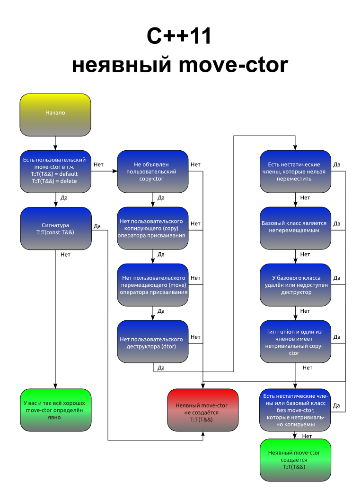
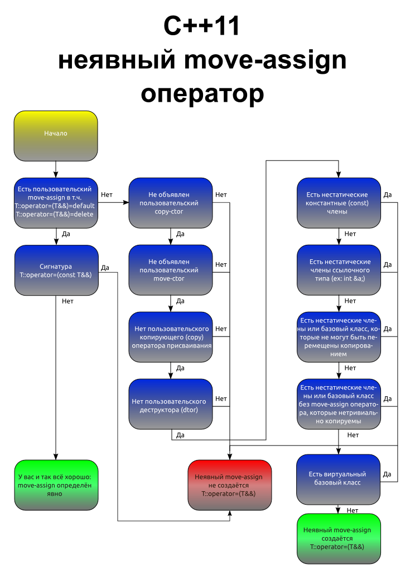

Perhaps this now-well-known table (by [Howard E. Hinnant](https://howardhinnant.github.io/classdecl.html)) can help with knowing which special member functions get implicitly defaulted, deleted or inhibited when the user declares other special member function

