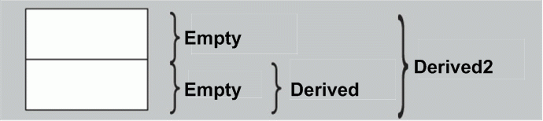

# sizeof (\<empty>)?
**complexity:** professional
```cpp
class Empty {};

int main()
{
    cout << sizeof(Empty) << endl;
}
```
Regarding code above what should be present in output?
- A. 0
- B. 1
- C. 2
- D. 4
- F. compiler dependent, but definitely greater than 0

**Answer:** F(B)

When instantiating an instance of any type (including "empty"), the physical memory must be allocated to it, since `operator &` (address acquisition) can be applied to every object in C ++. The Standard does not specify size of "empty" object. The minimum possible amount of memory is 1 byte and VC++ allocates it.

**See also:** [Bjarne Stroustrup's FAQ](http://www.stroustrup.com/bs_faq2.html#sizeof-empty), [EBO](http://en.cppreference.com/w/cpp/language/ebo) 

**Relatives:** [EBO](./README.md#sizeof-empty-aggregation-vs-inheritance)


# virtual destructor
**complexity:** basic
```cpp
struct shape
{
    virtual ~shape()       { cout << "shape destructor" << endl; }
};
struct rectangle : shape
{
   ~rectangle()            { cout << "rectangle destructor" << endl; }
};
struct decorated_rectangle : rectangle
{
   ~decorated_rectangle()  { cout << "decorated rectangle destructor" << endl; }
};

int main()
{
   rectangle* r = new decorated_rectangle();
   delete r;
}
```
Regarding code above what should be present in output?
- A.
    - rectangle destructor
- B.
    - decorated rectangle destructor
    - rectangle destructor
- C.
    - decorated rectangle destructor
    - rectangle destructor
    - shape destructor
- D.
    - shape destructor
    - rectangle destructor
    - decorated rectangle destructor


**Answer:** C

**See also:** [S. Meyers. Effective C++, item 7](https://books.google.com.ua/books?id=U7lTySXdFk0C&lpg=PT68&dq=Effective%20C%2B%2B%20declare%20destructors%20virtual&pg=PT68#v=onepage&q&f=false), [H.Sutter, GotW#5](https://herbsutter.com/2013/05/22/gotw-5-solution-overriding-virtual-functions/)
 
**Relatives:** [virtual dtor2](./README.md#virtual-destructor-part-2), [virtuality](./README.md#cost-of-the-virtuality)

# Object construction
**complexity:** basic
```cpp
struct member
{
   member() { cout << "member" << endl; }
};

struct base
{
   base()  { cout << "base" << endl; }
};

struct derived : base
{
   derived() { cout << "derived" << endl; }
private:
   member m_;
};

int main()
{
   derived obj;
}
```
Regarding code above what should be present in output?
- A.
    - member
    - base
    - derived
- B.
    - base
    - member
    - derived
- C.
    - base
    - derived
- D.
    - base
    - member
    - derived
- F.
    - derived

**Answer:** B 

**See also:** ???

**Relatives:** [ctor::exception](./README.md#object-construction-exception)
 

# Function overloading. Parameter type: integer vs. pointer
**complexity:** professional
```cpp
void foo(char*) {cout << "pointer argument" << endl; }
void foo(int)   {cout << "integer argument" << endl; }

int main()
{
   foo(NULL);
}
```
Regarding code above what should be present in output?
- A. pointer argument
- B. integer argument
- C. compiler error: ambiguous call to overloaded function

**Answer:** B

**NULL** is predefined macro with integer constant 0 (zero). foo(int) will be resolved due to __exact match__ between argument & parameter type.  

**See also:** [Bjarne Stroustrup's FAQ](http://www.stroustrup.com/bs_faq2.html#null)
 
**Relatives:**  [function overloading, nullptr](./README.md#function-overloading-parameter-type-null-vs-nullptr)

# Function overriding. Default parameter value.
**complexity:** professional
```cpp
struct base
{
   virtual void print(const char* colour = "red") const 
      { cout << "base::" << colour << endl; }
   virtual ~base() {}
};

struct derived : base
{
   void print(const char* colour = "green") const override 
      { cout << "derived::" << colour << endl; }
};

int main()
{
   base* obj = new derived;
   obj->print();
   delete obj;
}

```
Regarding code above what should be present in output?
- A. base::red
- B. derived::green
- C. base::green
- D. derived::red
- F. compiler error

**Answer:** D

`Static type` of 'obj' is base* but its `dynamic type` is derived*. Missed argument in the point of call is substituted by the compiler in compile-time based on static type information. Function 'print' is virtual (polymorphic) i.e. a decision which of them shoul be called will be resolved at run-time based on dymamic type information.   

**See also:** [S. Meyers. Effective C++, item 37](https://books.google.com.ua/books?id=U7lTySXdFk0C&pg=PT208&dq=Effective+C%2B%2B+Never+redefine+a+function’s+inherited+default+parameter+value&hl=en&sa=X&redir_esc=y#v=onepage&q&f=false)
 
# Object construction. Member initialization list.
**complexity:** basic
```cpp
struct part
{
   part()                        { cout << "part::default ctor" << endl; } 
   part(const char*)             { cout << "part::ctor(arg)"   << endl; } 
   part(const part&)             { cout << "part::copy ctor"   << endl; } 
   part& operator=(const part&)  { cout << "part::assignment operator" << endl; return *this; }
};

struct unit
{
   unit(const char* arg) { part_ = arg; }  // [2]
// unit(const char* arg) : part_(arg) {}   // [1]
private:
   part part_;
};

int main()
{
   unit obj{"exemplar"};
}
```
Regarding code above what should be present in output? Which of proposed constructors above (`[1]`,`[2]`) is more effective? Why?
- A. 
    - part::default ctor
    - part::copy ctor
    - part::assignment operator
- B. 
    - part::default ctor
    - part::assignment operator
- C. 
    - part::default ctor
    - part::ctor(arg)
    - part::assignment operator
- D. 
    - part::ctor(arg)

**Answer:** C

**See also:** [S. Meyers. Effective C++, item 4](https://books.google.com.ua/books?id=U7lTySXdFk0C&pg=PT56&dq=A+better+way+to+write+the+ABEntry+constructor+is+to+use+the+member+initialization+list+instead+of+assignments:&hl=en&sa=X&redir_esc=y#v=onepage&q&f=false)

**Relatives:** [ctor::member_ordering](./README.md#object-construction-member-initialization-list-vs-member-declaration-ordering)

# Inheritance. Hiding names.
**complexity:** professional
```cpp
struct base
{
   void foo(double) const { cout << "base::foo(double)" << endl; }  
};

struct derived : base
{
   void foo(const char*) const    { cout << "derived::foo(const char*)" << endl; }  
};

int main()
{
   derived d;
   d.foo(3.14);
}
```
Regarding code above what should be present in output?
- A. base::foo(double)
- B. derived::foo(const char*)
- C. compiler error: 'derived::foo(const char*)': cannot convert argument 1 from 'double' to 'const char*'

**Answer:** C

In C++, __there is no overloading across scopes__ - derived class scopes are not an exception to this general rule
The compiler looks into the scope of _'derived'_, finds the single function "foo(const char*)" and calls it. It never bothers with the (enclosing) scope of _'base'_.

**See also:** [S. Meyers. Effective C++, item 33](https://books.google.com.ua/books?id=U7lTySXdFk0C&pg=PT184&dq=Avoid+hiding+inherited+names.&hl=en&sa=X&redir_esc=y#v=onepage&q&f=false), [Bjarne Stroustrup's FAQ](http://www.stroustrup.com/bs_faq2.html#overloadderived), [ISOC++FAQ](https://isocpp.org/wiki/faq/strange-inheritance#hiding-rule)

**Relatives:** [scopes::hiding_names](./README.md#scopes-hiding-names)

# Inheritance. Virtual base.
**complexity:** expert
```cpp
class base
{
};

class derived1 : public base
{
};

class derived2 : virtual public base
{
};

int main()
{
   cout << sizeof(derived2) - sizeof(derived1) << endl;
}
```
Regarding code above what should be present in output?
- A. 0
- B. but definitely greater than 0 (compiler dependent)
- C. but definitely greater than 0 (platform dependent)

**Answer:** B

The Standatd does not specify size of `pointer` to a virtual table (vtbl).

**See also:** [S. Meyers. Effective C++, item 40](https://books.google.com.ua/books?id=U7lTySXdFk0C&pg=PT220&dq=Item+40:+Use+multiple+inheritance+judiciously.&hl=en&sa=X&redir_esc=y#v=onepage&q&f=false), [Bjarne Stroustrup's FAQ](http://www.stroustrup.com/bs_faq2.html#layout-obj)


# Object construction. Virtual Inheritance
**complexity:** expert
```cpp
struct base1
{
   base1() { cout << "base1" << endl; }
};

struct base2
{
   base2() { cout << "base2" << endl; }
};

struct derived : base1, virtual base2 
{
   derived() { cout << "derived" << endl; }
};

int main()
{
   derived d;
}
```
Regarding code above what should be present in output?
- A. 
    - base1
    - base2
    - derived
- B. 
    - base2
    - base1
    - derived
- C. 
    - derived
    - base1
    - base2

**Answer:** B 

Subobject of virtually inheritable class is **always** Initialized first regardless of the its location in the inheritance list.

**See also:** [S. Meyers. Effective C++, item 40](https://books.google.com.ua/books?id=U7lTySXdFk0C&pg=PT220&dq=Item+40:+Use+multiple+inheritance+judiciously.&hl=en&sa=X&redir_esc=y#v=onepage&q&f=false), [isocpp.org,FAQ](https://isocpp.org/wiki/faq/multiple-inheritance#mi-vi-ctor-order)


# Object construction. Member initialization list vs. member declaration ordering
**complexity:** professional
```cpp
class range
{
   size_t  distance_;
   size_t  begin_;
   size_t  end_;

public:
    range(size_t x1, size_t x2)
      : begin_(x1), end_(x2), distance_(end_ - begin_) 
   {}
   size_t distance() const { return distance_; }
};

void main()
{
   range r(1,9);
   cout << r.distance() << endl;
}
```
Regarding code above what should be present in output?
- A. 1
- B. 9
- C. 0
- D. \<undefined\>
- F. 8

**Answer:** D (C) 

Data members are initialized __in the order in which they are declared__. This is true
even if they are listed in a different order on the member initialization
list. __D__ is the right answer in common case. For the the given test, __C__ is also correct, because of members `begin_`, `end_` are of build-in type which are initialized with 0 (zero) before `range::range()` invokation.

**See also:** [S. Meyers. Effective C++, item 4](https://books.google.com.ua/books?id=U7lTySXdFk0C&pg=PT56&dq=A+better+way+to+write+the+ABEntry+constructor+is+to+use+the+member+initialization+list+instead+of+assignments:&hl=en&sa=X&redir_esc=y#v=onepage&q&f=false), [CppCoreGuidelines](https://isocpp.github.io/CppCoreGuidelines/CppCoreGuidelines.html#discussion-define-and-initialize-member-variables-in-the-order-of-member-declaration)

**Relatives:** [ctor::member_initialization_list](./README.md#object-construction-member-initialization-list)

# Polymorphic objects. Slicing
**complexity:** basic
```cpp
struct base
{
    virtual void foo() const { cout << "base" << endl; }
};

struct derived : base
{
    void foo() const override { cout << "derived" << endl; }
};

void display(const base* obj)
{
    obj->foo();
}

void display(const base obj)
{
    obj.foo();
}

void main()
{
   const derived d;
   display(&d);
   display(d);
}
```
Regarding code above what should be present in output? 
Can a virtual method be virtual?
- A. 
    - derived
    - derived
- B. 
    - derived
    - base
- C. 
    - base
    - base
- D. 
    - base
    - derived

**Answer:** B 

If you have a class with virtual method then you should access it through object pointer or reference. Otherwise you will have type __slicing__ - a copying a portion (base part) of the whole object. If you use **_object itself_** syntax to invoke a virtual method then polymorphic sence is lost i.e. object's `dynamic type` is equal to its `static type`. Thus, for this particular case, a virtual method can be threated as inlined.

**See also:** [CppCoreGuidelines](https://github.com/isocpp/CppCoreGuidelines/blob/master/CppCoreGuidelines.md#c145-access-polymorphic-objects-through-pointers-and-references)

**Relatives:** 

# Cost of the virtuality?
**complexity:** professional
```cpp
class point
{   // designed as a terminal class
    size_t x_;
    size_t y_;
public:
    point(size_t x, size_t y) : x_(x), y_(y) {}
    ~point() {}
};

class spot
{   // designed to be used as a base, OOP style
    size_t x_;
    size_t y_;
public:
    spot(size_t x, size_t y) : x_(x), y_(y) {}
    virtual ~spot() {}
};

void main()
{
   cout << sizeof(spot) - sizeof(point) << endl;
}
```
Regarding code above what should be present in output? 
- A. 0 
- B. sizeof(void*)
- C. compiler dependent
- D. platform depentedt

**Answer:** C 

The Standard does not say how the virtual table and the pointer to it should be implemented.

**See also:** [S. Meyers. Effective C++, item 7](https://books.google.com.ua/books?id=U7lTySXdFk0C&pg=PT72&dq=destructors+virtual+in+polymorphic+base+classes.%5C&hl=en&sa=X&redir_esc=y#v=onepage&q&f=false), [Bjarne Stroustrup's FAQ](http://www.stroustrup.com/bs_faq2.html#layout-obj)

**Relatives:** [virtual destructor](./README.md#virtual-destructor)

# Size Of C++ object (members only)?
**complexity:** basic
```cpp
struct point
{
    size_t x_;
    size_t y_;
};

class spot
{
    size_t x_;
    size_t y_;

public:
    spot(size_t x, size_t y) : x_(x), y_(y) {}

    // data accessors
    unsigned long   getX() const   { return x_; }
    void            setX(size_t x) { x_=x; }
    unsigned long   getY() const   { return y_; }
    void            setY(size_t y) { y_=y; }
};

void main()
{
   cout << sizeof(spot) - sizeof(point) << endl;
}
```
Regarding code above what should be present in output? 
- A.  0 
- B. <0
- C. >0
- D. compiler dependent.

**Answer:**  

Function-member does not impact on the object size.

**See also:** [Bjarne Stroustrup's FAQ](http://www.stroustrup.com/bs_faq2.html#layout-obj)

**Relatives:** 

# Object construction. Exception
**complexity:** basic
```cpp
struct part
{
   part()   { cout << "part::ctor" << endl; } 
   ~part()  { cout << "part::dtor" << endl; }
};

class unit
{
   part part_;
public:
   unit()
   { 
      cout << "unit::ctor" << endl;       
      throw std::logic_error("something wrong");
   }
   ~unit() { cout << "unit::dtor" << endl; }
};

int main()
{
   try {
   unit obj;
   } 
   catch(const std::exception& e)
   {
      cout << e.what() << endl;
   }
}
```
Regarding code above what should be present in output? 
- A.  
    - part::ctor
    - unit::ctor
    - unit::dtor
    - part::dtor
    - something wrong
- B. 
    - part::ctor
    - unit::ctor
    - something wrong
- C. 
    - part::ctor
    - unit::ctor
    - part::dtor
    - something wrong
- D. 
    - part::ctor
    - unit::ctor
    - something wrong
    - unit::dtor
    - part::dtor

**Answer:** C

In C++ the lifetime of an object is said to begin when the constructor runs to completion. And it ends right when the destructor is called. If the ctor throws, then the dtor is not called. 

**See also:** [Bjarne Stroustrup's FAQ](http://www.stroustrup.com/bs_faq2.html#ctor-exceptions), [Herb Sutter’s Mill](https://herbsutter.com/2008/07/25/constructor-exceptions-in-c-c-and-java/)

**Relatives:** [ctor::member](./README.md#object-construction), [delegating ctor](./README.md#object-construction-exception-in-delegating-constructor), [ctor::exception, part2](./README.md#object-construction-in-the-heap-exception)

# Deducing Types. Template parameter.
**complexity:** basic
```cpp
template<typename T>
void f(T param)
{
   cout << "param type: " << typeid(param).name() << endl;
}

const char* const ptr =  "Fun with pointers";

int main()
{
   f(ptr);
}
```
Regarding code above what should be present in output? 
- A. const char* const  
- B. const char*
- C. char* const
- D. char*

**Answer:** B

Qualifiers `const` and `volatile` are ignored only for _by-value_ parameters.
For parameters that are _references-to-_ or _pointers-to-const_, the constness of _expr_ (input argument) is preserved during type deduction.
In our case, _expr_ (ptr) is a const pointer to a const object, and _expr_ is passed to a _by-value_ param.
Thus, the constness of 'ptr' will be ignored, but the constness of what 'ptr' points to is preserved. 

**See also:** [S. Meyers. Effective Modern C++, item 1.1](https://www.safaribooksonline.com/library/view/effective-modern-c/9781491908419/ch01.html)

**Relatives:** [template parameter by reference](./README.md#deducing-types-template-parameter-by-reference)

# 'C' array as function parameter. Decay of types.
**complexity:** professional
```cpp
void foo(int arg[3])
{
   arg[0] = 100;
   arg[1] = 200;
   arg[2] = 300;
}

int main()
{
   int arr[] = {1,2,3};
   foo(arr);
   cout << "arr[3]: " << arr[0] << ", " << arr[1] << ", "<< arr[2] << endl;
}
```
Regarding code above what should be present in output? 
- A. arr[3]: 1, 2, 3 
- B. arr[3]: 100, 200, 300
- C. compiler error. 'foo(int [])' parameter 'arg' passed by-value cannot be copied.

**Answer:** B

It's an illusion that 'arg' passed _by-value_. In this context, an array __decays__ into a pointer to its first element (C language legacy).
A legal syntax of function declaration `void foo(int arg[3])` is equivalent to `void foo(int* arg)`.
Thus, an array argument is passed into 'foo' as a pointer, not by-value i.e. there is no copying.
Moreover, 'C' array is not copyable.

**See also:** [S. Meyers. Effective Modern C++, item 1.1](https://www.safaribooksonline.com/library/view/effective-modern-c/9781491908419/ch01.html)

**Relatives:** 

# Object construction. Virtual call
**complexity:** basic
```cpp
struct base
{
   string name_;

   virtual string name() const { return "base"; }
   base() { name_ = name(); }
   virtual ~base() {}
};

struct derived : base
{
   string name_;

   virtual string name() const override { return "derived"; }
   derived() { name_ = name(); }
};

int main()
{
   derived d;
   cout << d.base::name_ << endl
        << d.name_       << endl;
}
```
Regarding code above what should be present in output? 
- A. 
    - base
    - derived
- B. 
    - base
    - base
- C. 
    - derived
    - derived
 
**Answer:** A 

In a constructor, the virtual call mechanism __is disabled__ because overriding from derived classes hasn't yet happened. Objects are constructed from the base up, "base before derived".

**See also:** [Bjarne Stroustrup's FAQ](http://www.stroustrup.com/bs_faq2.html#vcall), [C++ Coding Standards, rule 49](https://books.google.com.ua/books?id=mmjVIC6WolgC&pg=PT238&lpg=PT238&dq=C%2B%2B+Sutter+destructor+direct+call&source=bl&ots=ceOoHQiMZ4&sig=s0DhJh0lBmNK8CqDNJUVgUe3bBg&hl=en&sa=X&ved=0ahUKEwiO6IDA9-zVAhUosFQKHdIABZMQ6AEISjAG#v=onepage&q&f=false), [ISOC++FAQ](https://isocpp.org/wiki/faq/strange-inheritance#calling-virtuals-from-ctors)

**Relatives:** [ctor::basic](./README.md#object-construction)

# Deducing Types. 'auto' by-value.
**complexity:** basic
```cpp
int main()
{
	const int  theNumber {44};
	
	auto   x  = theNumber;
	auto   y  = &theNumber;

   cout << typeid(x).name() << " - " << typeid(y).name() << endl;
}
```
Regarding code above what should be present in output? 
- A. const int - const int *
- B. int - const int *
- C. int - int *
- D. const int - int *

**Answer:** B

`auto` type deduction is usually the same as template type deduction. types 'x' and 'y' are deduced based on passing _left-hand expression_ `by-value`.
That means: `const` and/or `volatile` _expression_ are treated as non-`const` and non-`volatile`.
In our case, type of _expression_ for 'x' is const int; type of _expression_ for 'y' is a __pointer to__ const int and this pointer is passed `by-value`.

**See also:** [S. Meyers. Effective Modern C++, item 1.1](https://www.safaribooksonline.com/library/view/effective-modern-c/9781491908419/ch01.html), [auto and decltype Explained](http://thbecker.net/articles/auto_and_decltype/section_01.html), [Type Deduction and Why You Care](https://www.aristeia.com/TalkNotes/C++TypeDeductionandWhyYouCareCppCon2014.pdf)

**Relatives:** [template_param::by_value](./README.md#deducing-types-template-parameter)

# Deducing Types. 'auto' by-reference.
**complexity:** professional
```cpp
int main()
{
	const char name[] = "R. N. Briggs";
	
	auto   x  = name;
	auto&  y  = name;

   cout << typeid(x).name() << " - " << typeid(y).name() << endl;
}
```
Regarding code above what should be present in output? 
- A. const char* - const char*
- B. const char* - const char (&)[13]
- C. const char [13] - const char(&) [13]
- D. const char [13] - const char* 

**Answer:** B

Type of 'x' is deduced `by-value` rule. The expression on the right side of `operator=` is pointer to const char (see [type decaying](./README.md#c-array-as-function-parameter-decay-of-types)).
Type of 'y' is deduced `by-reference` rule, i.e. it is the actual type of the array.

**See also:** [S. Meyers. Effective Modern C++, item 2](https://www.safaribooksonline.com/library/view/effective-modern-c/9781491908419/ch01.html), [auto and decltype Explained](http://thbecker.net/articles/auto_and_decltype/section_01.html), [Type Deduction and Why You Care](https://www.aristeia.com/TalkNotes/C++TypeDeductionandWhyYouCareCppCon2014.pdf)

**Relatives:** [C array vs pointer](./README.md#c-array-as-function-parameter-decay-of-types), [deducing_type::by-value](./README.md#deducing-types-auto-by-value), [decltype of reference](./README.md#auto-vs-decltype-with-an-expression-by-reference), [template parameter by reference](./README.md#deducing-types-template-parameter-by-reference)

# new/delete vs. new[]/delete[].
**complexity:** basic
```cpp
struct widget
{
   widget()  { cout << "ctor" << endl; }
   ~widget() { cout << "dtor" << endl; }
};

int main()
{
   auto p = new widget[2];
   delete p;
}
```
Regarding code above what should be present in output? 
- A. 
    - ctor
    - ctor
    - dtor
    - dtor
- B. 
    - ctor
    - ctor
    - dtor
- C. run-time error 

**Answer:** C (B)

According to the Standatd, the program's behaviour is undefined.
At the very least, only one of 2 (N, the arbitrary number of  array dimension) widgets pointed to by 'p' will be properly destroyed, because destructors for rest of them will never be called.

**See also:** [S. Meyers. Effective C++, item 16](https://books.google.com.ua/books?id=U7lTySXdFk0C&pg=PT101&dq=Use+the+same+form+in+corresponding+uses+of+new+and+delete.&hl=en&sa=X&redir_esc=y#v=onepage&q&f=false)

**Relatives:** 

# Object lifetime. Destructor direct call. 
**complexity:** basic
```cpp
struct widget
{
   ~widget() { cout << "dtor" << endl; }
};

int main()
{
   widget w;
   w.~widget(); // line:A
}
```
Regarding code above what should be present in output? 
- A. 
    - dtor
- B. 
    - dtor
    - dtor
- C. run-time error: undefined behaviour
- D. compile-time error: incorrect syntax at _//line:A_  

**Answer:** B 

Statement _w.~widget()_ is legal code, dcor likes a normal member-function. But it's a [bad habit](http://www.gotw.ca/gotw/022.htm) to get into.

**See also:** [H. Sutter. GotW #22](http://www.gotw.ca/gotw/022.htm)

**Relatives:** 

# Object lifetime. const-reference to the temporary. 
**complexity:** expert
```cpp
string foo() { return "abc"; }

int main()
{
   const string& s = foo();   // line B
   cout << s << endl;         // line C
}
```
Regarding code above what should be present in output? 
- A. abc
- B. compiler error: [line B] reference cannot be bound to an lvalue
- C. run-time error: [line C] memory violation

**Answer:**  A

Function 'foo()' returns a temporary object of `string` type. Normally, a temporary object lasts only until the end of the full expression in which it appears. However, C++ deliberately specifies that binding a temporary object to a reference to const on the stack lengthens the lifetime of the temporary to the lifetime of the reference itself, and thus avoids what would otherwise be a common dangling-reference error.
In the example above, the temporary returned by 'foo()' lives until the closing curly brace of `main`.

**See also:** [H. Sutter. GotW #88](https://herbsutter.com/2008/01/01/gotw-88-a-candidate-for-the-most-important-const/), [Lifetime of a temporary](http://en.cppreference.com/w/cpp/language/reference_initialization#Lifetime_of_a_temporary)

**Relatives:** [part_2](./README.md#object-lifetime-const-reference-to-the-temporary-part-2) , [reference initialization](./README.md#reference-initialization)

# Object lifetime. const-reference to the base. 
**complexity:** expert
```cpp
struct base
{
   ~base() { cout << "~base()" << endl; }
};

struct derived : base
{
   ~derived() { cout << "~derived()" << endl; }
};

derived make_instance()
{
   return derived{};
}

int main()
{
   {
      const base& b = make_instance(); // line A
      cout << "end of the local scope" << endl; 
   }
}
```
Regarding code above what should be present in output? 
- A. compiler error: [line A] reference cannot be bound to an lvalue
- B. 
    - ~deriver
    - ~base
    - end of the local scope
- C
    - end of the local scope
    - ~deriver
    - ~base
- D
    - end of the local scope
    - ~base

**Answer:** C

If we have `const` 'base' reference to 'derived' temporary, it will be destroyed _without virtual dispatch on the destructor call_. 

**See also:** [H. Sutter. GotW #88](https://herbsutter.com/2008/01/01/gotw-88-a-candidate-for-the-most-important-const/)

**Relatives:** [const-reference to the temporary](./README.md#object-lifetime-const-reference-to-the-temporary)

# std::shared_ptr. non-virtual destructor. 
**complexity:** expert
```cpp
struct base_virtual
{
   virtual ~base_virtual() {}
};

struct base_nonvirtual
{
   ~base_nonvirtual() {}
};

struct derived1 : base_virtual
{
   ~derived1() { cout << "~derived1" << endl; }
};

struct derived2 : base_nonvirtual
{
   ~derived2() { cout << "~derived2" << endl; }
};

int main()
{
   shared_ptr<base_virtual>      d1 { new derived1 {} };
   shared_ptr<base_nonvirtual>   d2 { new derived2 {} };
}
```
Regarding code above what should be present in output? 
- A.
    - ~derived2
    - ~derived1
- B. 
    - ~derived1
- C
    - ~derived1
    - ~derived2

**Answer:** A

Class template `shared_ptr<T>` has function template (constructor) `shared_ptr(Y*)`, where Y* must be convertible to T*.
This constructor with _Y=derived_ creates the appropriate deleter object based on Y type, not T type.
This deleter is called when the shared_ptr object is about to free the pointed resource.

**See also:** [stackoverflow,shared_ptr magic](https://stackoverflow.com/questions/3899790/shared-ptr-magic), [cppreference,shared_ptr ctor3](http://en.cppreference.com/w/cpp/memory/shared_ptr/shared_ptr)

**Relatives:** 

# Type conversion. const-reference to the temporary. 
**complexity:** professional
```cpp
void display(string& s)
{
   cout << "[string&]-> " << s << endl;    
}

void display(const string& s)
{
   cout << "[const string&]-> " << s << endl;    
}

int main()
{
   display("hello, world!");
}
```
Regarding code above what should be present in output? 
- A. [string&]-> hello, world!
- B. [const string&]-> hello, world!
- C. compiler error: 'display' ambiguous call to overloaded function
- D. compiler error: 'display' cannot convert parameter 1 from char* to string&

**Answer:** B 

Function 'display' parameter type (`string&`) and type (`const char*`) of the argument passed in it are mismatch.
This call can succeed only if the type mismatch can be eliminated, the compiler will be happy to eliminate it by creating a temporary object of type `string`.
The 's' parameter of 'display' is then bound to this temporary `string` object.
But binding a temporary object to reference is only possible if this reference itself is `const`.  
When 'display' returns, the temporary object is automatically destroyed. 

**See also:** [S. Meyers. Effective C++, item 5,19](http://www.physics.rutgers.edu/~wksiu/C++/MoreEC++_only.pdf), [H. Sutter. GotW #88](https://herbsutter.com/2008/01/01/gotw-88-a-candidate-for-the-most-important-const/) 

**Relatives:** [part 3](./README.md#const-reference-to-the-temporary-part-3), [object lifetime referenced by const](./README.md#object-lifetime-const-reference-to-the-temporary), [implicit conversion](./README.md#type-conversion-implicitly-)

# Function overriding. member template & virtuality. 
**complexity:** expert
```cpp
struct base
{
   template <typename T>
   virtual void foo(const T& a) const { cout << "base::foo -> " << a << endl; }
   virtual ~base() {}
};

struct derived : base
{
   template <typename T>
   void foo(const T& a) const override { cout << "derived::foo -> " << a << endl; }
};

int main()
{
   unique_ptr<base> b { new derived{} };
   b->foo("hello,world!");    
}
```
Regarding code above what should be present in output? 
- A. base::foo -> hello,world! 
- B. derived::foo -> hello,world!
- C. compiler error: 'void base::foo(const T &) const': member function templates cannot be virtual

**Answer:** C  

> This _must_ be illegal, otherwise we would have to add another entry to the virtual table
for class 'base' each time someone called base::foo() with a new
argument type. This would imply that __only the linker__ could make virtual function
tables and assign table positions to functions. Consequently, a member template cannot
be `virtual`. — Bjarne Stroustrup, [D&E Of C++, ch 15.9.3](http://doc.imzlp.me/viewer.html?file=docs/cpp/TheDesignAndEvolutionOfCpp.pdf)

**See also:** [StackOverflow](https://stackoverflow.com/questions/2354210/can-a-c-class-member-function-template-be-virtual) 

**Relatives:** 

# Function overloading. Parameter type: NULL vs. nullptr
**complexity:** basic
```cpp
void foo(char*) {cout << "pointer argument" << endl; }
void foo(int)   {cout << "integer argument" << endl; }

int main()
{
   foo(nullptr);
}
```
Regarding code above what should be present in output?
- A. pointer argument
- B. integer argument
- C. compiler error: ambiguous call to overloaded function

**Answer:** A

`nullptr` (C++11 keyword) is a literal denoting the null pointer; it is not an integer.

**See also:** [Bjarne Stroustrup's C++11 FAQ](http://www.stroustrup.com/C++11FAQ.html#nullptr), [S. Meyers. Effective Modern C++, item 8](https://books.google.com.ua/books?id=rjhIBQAAQBAJ&lpg=PP1&dq=meyers%20modern%20c%2B%2B%20NULL%20nullptr&pg=PA58#v=onepage&q&f=false)

**Relatives:**  [function overloading, NULL](./README.md#function-overloading-parameter-type-integer-vs-pointer)

# Inheritance. Virtual base & dominance.
**complexity:** expert
```cpp
struct grandparent
{
   virtual void foo() { cout << "grandparent::foo" << endl; }
};

struct mother : virtual grandparent
{
};

struct father : virtual grandparent
{
   void foo() override { cout << "father::foo" << endl; }
};

struct child : mother, father
{
   child() { foo(); } // Line A
};

int main()
{
   child c;
}
```
Regarding code above what should be present in output?
- A. grandparent::foo 
- B. father::foo
- C. compiler error: [Line A], 'foo()' - ambigious call

**Answer:** B

Above, the classic _'diamond inheritance'_ is shown. Whome kind of behaviour has the child inherited: either from the grandpa indirectly through mother's branch or from the father directly?
'father::foo' predominates because of an inheritance path for the child is twice as shorter (one degree) as path to grandpa (two degreees). 

**See also:** [wiki:dominance](https://en.wikipedia.org/wiki/Dominance_%28C%2B%2B%29#Example_with_virtual_inheritance), [stackoverflow:dominance](https://stackoverflow.com/questions/7210860/dominance-in-virtual-inheritance)

**Relatives:**

# Object construction. Exception in delegating constructor
**complexity:** professional
```cpp
struct unit
{
   unit(size_t n)  { cout << "unit::ctor (principal)" << endl; }
   unit() : unit(0) // Line A
   { 
      cout << "unit::ctor (delegating)" << endl;       
      throw std::logic_error("something wrong");
   }
   ~unit() { cout << "unit::dtor" << endl; }
};

int main()
{
   try
   {
      unit obj;
   }
   catch(const exception& e)
   {
      cout << e.what() << endl;
   }
}
```
Regarding code above what should be present in output? 
- A.  
    - unit::ctor (principal)
    - unit::ctor (delegating)
    - unit::dtor
    - something wrong
- B. 
    - unit::ctor (delegating)
    - unit::ctor (principal)
    - unit::dtor
    - something wrong
- C. 
    - unit::ctor (principal)
    - unit::ctor (delegating)
    - something wrong
- D. 
    - compiler error: // Line A, syntax error

**Answer:** A

- unit::unit(size_t n) is a _'principal constructor'_
- unit::unit() is a _delegating constructor_ which calls the principal one directly.
- unit::~unit(), upon scope unwinding, the destructors of fully-constructed object is called. 

An unit object's lifetime begins when some constructor (in our case _'principal constructor'_) has finished. (See C++ Standard, 15.2/2)

**See also:** [stackoverflow, delegating constructor throws](https://stackoverflow.com/questions/14386840/destructor-called-after-throwing-from-a-constructor)

**Relatives:** [ctor::exception](./README.md#object-construction-exception) 

# Exception. Catch by value
**complexity:** professional
```cpp
struct my_exception
{
   my_exception()                   { cout << "exception::ctor(default)" << endl; }   
   my_exception(const my_exception&){ cout << "exception::ctor(copy)" << endl; }   
   my_exception(my_exception&&)     { cout << "exception::ctor(move)" << endl; }   
   my_exception& operator=(const my_exception&)
                                    { cout << "exception::assigment(copy)" << endl; }   
   my_exception& operator=(my_exception&&)
                                    { cout << "exception::assigment(move)" << endl; }   
};

int main()
{
   try
   {
      // ...
      my_exception e;
      throw e;
   }
   catch(my_exception e)
   {
      // e.what();
   }
}
```
Regarding code above what should be present in output? 
- A.  
    - exception::ctor(default)
    - exception::ctor(copy)
- B. 
    - exception::ctor(default)
    - exception::ctor(copy)
    - exception::ctor(copy)
- C. 
    - exception::ctor(default)
    - exception::ctor(move)
    - exception::ctor(copy)
- D. 
    - exception::ctor(default)
    - exception::assigment(copy)
    - exception::ctor(copy)
- E. 
    - exception::ctor(default)
    - exception::assigment(move)
    - exception::ctor(copy)


**Answer:** C

To avoid unnecessary copying of the exception object and object slicing, the best practice for catch clauses is to catch by reference

**See also:** [C++ Coding Standards, item 73](https://doc.lagout.org/programmation/C/CPP101.pdf), [CppCoreGuidelines, E.15](https://github.com/isocpp/CppCoreGuidelines/blob/master/CppCoreGuidelines.md#e15-catch-exceptions-from-a-hierarchy-by-reference)

**Relatives:** [Type slicing](./README.md#polymorphic-objects-slicing)

# Exception. Multiple inheritance
**complexity:** expert
```cpp
struct my_exc1    : std::exception
{ 
   char const* what() const { return "my_exc1"; } 
};

struct my_exc2    : std::exception 
{ 
   char const* what() const { return "my_exc2"; } 
};

struct your_exc3  : my_exc1, my_exc2 
{
   char const* what() const { return "your_exc3"; } 
};

int main()
{
   try { throw your_exc3{}; }
   catch(const std::exception& e) 
   {
      cout << e.what() << endl; 
   }
   catch(...) 
   { 
      cout << "whoops!" << endl; 
   }
}
```
Regarding code above what should be present in output? 
- A. my_exc1  
- B. my_exc2
- C. your_exc3
- D. whoops!
- E. compiler error: std::'exception' is ambiguous.

**Answer:** D

The program above prints "whoops" because the C++ runtime can't resolve which `exception` instance to match in the first _catch_ clause.

**See also:** [D. Abrahams, boost::exception_handling](http://www.boost.org/community/error_handling.html) 

**Relatives:** [Multiple Inheritance. Type conversion to base](./README.md#type-conversion-base-in-multiple-inheritance)

# Type conversion. Base in multiple inheritance
**complexity:** basic
```cpp
struct grandparent
{
   virtual void foo() const { cout << "grandparent::foo" << endl; }
   virtual ~grandparent() {}
};

struct mother : grandparent
{
   void foo() const override { cout << "mother::foo" << endl; }
};

struct father : grandparent
{
   void foo() const override { cout << "father::foo" << endl; }
};

struct child : mother, father
{
   void foo() const override { cout << "child::foo" << endl; }
};

int main()
{
   grandparent* p = new child{}; 
   p->foo();
   delete p;
}
```
Regarding code above what should be present in output? 
- A. grandparent::foo 
- B. mother::foo
- C. father::foo
- D. child::foo
- E. compiler error: ambiguous conversions from 'child *' to 'grandparent *' 

**Answer:** E

The compiler does not know what kind of subobject of whole 'child' you want to point out. It can be subobject of 'grandparent' comes from either 'mother' branch or 'father' branch.

**See also:** [S.Meyers. Effective C++, item 40](https://books.google.com.ua/books?id=Qx5oyB49poYC&pg=PA192&dq=Use+multiple+inheritance+judiciously.&hl=en&sa=X&ved=0ahUKEwio6Ou_ypLWAhWIKGMKHVZMCGoQ6AEILjAB#v=onepage&q&f=false)

**Relatives:** [exception::multiple_inheritance](./README.md#exception-multiple-inheritance)

# Return value optimization
**complexity:** professional
```cpp
struct widget
{
   widget()                         { cout << "ctor(default)" << endl; }
   widget(const widget&)            { cout << "ctor(copy)" << endl; }
   widget(widget&&)                 { cout << "ctor(move)" << endl; }
   widget& operator=(const widget&) { cout << "assigment(copy)" << endl; }
   widget& operator=(widget&&)      { cout << "assigment(move)" << endl; }
};

widget make_widget()
{
   return widget{};
}

int main()
{
   auto w = make_widget();
}

```
Regarding code above what should be present in output? 
- A. 
    - ctor(default)
- B. 
    - ctor(default)
    - ctor(copy)
- C. 
    - ctor(default)
    - ctor(move)
- D. 
    - ctor(default)
    - ctor(move)
    - ctor(move)
- E. 
    - ctor(default)
    - ctor(move)
    - assigment(move)

**Answer:** A (since C++17, but all others are also possible)
 
> This particular optimization — eliminating a local temporary by using a function's return location (and possibly replacing that with an object at
the function's call site) — is both well-known and __commonly__ implemented. It even has a name: _the return value
optimization_. In fact, the existence of a name for this optimization may explain why it's so widely available
— Scott Meyers, 1996

But the RVO is an optimization. Compilers aren’t required to elide copy and move
operations, even when they’re permitted to.

> You can trust me when I tell you that for this
code, every decent C++ compiler will employ the RVO to avoid copying 'w' — Scott Meyers, 2014
 
Starting from C++17, another way to describe this mechanics is "unmaterialized value passing": prvalues are returned and used without ever materializing a temporary.

**See also:** [Copy elision](http://en.cppreference.com/w/cpp/language/copy_elision), [RVO](https://en.wikipedia.org/wiki/Return_value_optimization), [S. Meyers. More Effective C++, item 20](https://books.google.com.ua/books?id=U7lTySXdFk0C&pg=PT439&dq=Facilitate+the+return+value+optimization.+Meyers&hl=en&sa=X&redir_esc=y#v=onepage&q&f=false)

**Relatives:** [RVO & std::move](./README.md#stdmovervo), [ObjectConstructionOneCopy](./README.md#object-construction-copy-elision), [Explicit copy constructor](./README.md#explicit-copy-constructor)

# sizeof (\<empty>)? aggregation vs. inheritance.
**complexity:** expert
```cpp
class Empty {};

class Aggregator
{
   Empty member_;
   int   another_;
};

class Derived : Empty
{
   int   another_;
};

int main()
{
   static_assert(sizeof(Aggregator) == sizeof(Derived),"agregator == derived");
   static_assert(sizeof(Aggregator)  < sizeof(Derived),"agregator <  derived");
   static_assert(sizeof(Aggregator) >  sizeof(Derived),"agregator >  derived");
}
```
Regarding code above what should be present in output?
- A. compiler error:
    - agregator <  derived
    - agregator >  derived
- B. compiler error:
    - agregator == derived
    - agregator > derived
- C. compiler error:
    - agregator == derived
    - agregator < derived
- D. compiler error:
    - agregator == derived
    - agregator < derived
    - agregator > derived

**Answer:** C

C++ requires empty classes to have non-zero size to ensure object identity.
but there is a special exemption for empty classes when they are inherited from. The compiler is allowed to flatten the inheritance hierarchy in a way that the empty base class does not consume space.

**See also:** [cppreference,EBO](http://en.cppreference.com/w/cpp/language/ebo), [More C++ Idioms, EBO](https://en.wikibooks.org/wiki/More_C%2B%2B_Idioms/Empty_Base_Optimization)

**Relatives:** [sizeof(empty)](./README.md#sizeof-empty), [EBCO multiple inheritance](./README.md#sizeof-empty-multiple-inheritance)

# std::move(RVO)
**complexity:** expert
```cpp
struct widget
{
   widget()                         { cout << "ctor(default)" << endl; }
   widget(const widget&)            { cout << "ctor(copy)" << endl; }
   widget(widget&&)                 { cout << "ctor(move)" << endl; }
   widget& operator=(const widget&) { cout << "assigment(copy)" << endl; }
   widget& operator=(widget&&)      { cout << "assigment(move)" << endl; }
};

widget make_widget()
{
   return std::move(widget{});
}

int main()
{
   auto w = make_widget();
}

```
Regarding code above what should be present in output? 
- A. 
    - ctor(default)
- B. 
    - ctor(default)
    - ctor(copy)
- C. 
    - ctor(default)
    - ctor(move)
- D. 
    - ctor(default)
    - ctor(move)
    - ctor(move)
- E. 
    - ctor(default)
    - ctor(move)
    - assigment(move)

**Answer:** C
 
Compilers may elide (since C++17, [must elide](http://en.cppreference.com/w/cpp/language/copy_elision)) the copying (or moving) (see [RVO](https://en.wikipedia.org/wiki/Return_value_optimization)) of a _local_ object in a function that returns _by value_ 
- if the type of the local object is the same as that returned by the function 
- and the local object is what’s being returned

Instruction `return std::move(w);` violates the second statement above, because of the returned value is not a local object, it's a _reference_ to 'w'.
This manual negative optimization remains in C++17, moving a temporary object prevents [copy elision](http://en.cppreference.com/w/cpp/language/copy_elision). 


**See also:** [S. Meyers. Effective Modern C++, item 25](https://books.google.com.ua/books?id=rjhIBQAAQBAJ&pg=PA174&dq=I+can+perform+the+same+optimization+on+local+variables+that+I%E2%80%99m+returning&hl=en&sa=X&ved=0ahUKEwit19aGgJXWAhXLrlQKHdTqANQQ6AEIKTAA#v=onepage&q&f=false) 

**Relatives:** [RVO](./README.md#return-value-optimization), [C++17 copy_elision](./README.md#object-construction-copy-elision)

# Function overloading. Promotion vs. standard conversion 
**complexity:** professional
```cpp
void foo(int)
{
   cout << "foo(int)" << endl;
}

void foo(char)
{
   cout << "foo(char)" << endl;
}

int main()
{
   foo(true);
}
```
Regarding code above what should be present in output?
- A. foo(int)
- B. foo(char)
- C. compiler error: 'foo' ambigious call

**Answer:** A

Argument type `bool` and function 'foo' parameter type are mismatch.
How well a given argument `bool` matches the corresponding parameter of a viable two candidates?
The possible matches as follows (from best to worst):
* Match with __promotion__, the implicit conversion that includes the conversion of small integral types (such as `bool` , `char` , `short` , and sometimes enumerations) to `int`. 
* Match with __standard conversions__ only. This includes any sort of standard conversion (such as `int` to `float`)

For the given case, the '__promotion__' is better because of '__standatd conversion__' is stronger. 

**See also:** [cppreference::ranking](http://en.cppreference.com/w/cpp/language/overload_resolution), [accu.org::function selection](https://accu.org/index.php/journals/268), [D. Vandevoorde. C++ Templates, Appendix B](http://flylib.com/books/en/3.401.1.178/1/)  
 
**Relatives:** [user-defined conversion](./README.md#type-conversion-user-defined-vs-standard-conversion) 

# Function overloading. Deleted function 
**complexity:** expert
```cpp
void foo(int) = delete;

void foo(char)
{
   cout << "foo(char)" << endl;
}

int main()
{
   foo(true);
}
```
Regarding code above what should be present in output?
- A. foo(char)
- B. compiler error: 'foo(int)' attempting to reference a deleted function
- C. compiler error: 'foo' ambigious call

**Answer:** B

The phases of the function call process:
* (1) Name lookup
* (2) Overload resolution
* (3) Access control

Second phase '_overload resolution_' results only ['foo(int)'](./README.md#function-overloading-promotion-vs-standard-conversion). The next phase says: "access violation to deleted function".
Please take the difference between 'deleted function' and 'non-existing function'.

**See also:** [S. Meyers. Effective Modern C++, item 11](https://edisciplinas.usp.br/pluginfile.php/1995323/mod_resource/content/1/Effective%20Modern%20C%2B%2B%202014.pdf), [accu.org::function selection](https://accu.org/index.php/journals/268), [D. Vandevoorde. C++ Templates, Appendix B](http://flylib.com/books/en/3.401.1.178/1/)  
 
**Relatives:** [Promotion & Standard Conversion](./README.md#function-overloading-promotion-vs-standard-conversion), [access control](./README.md#function-overloading-access-control)

# final specifier. Member function definition. 
**complexity:** basic
```cpp
struct base
{
   virtual void foo() const { cout << "base::foo" << endl;}
};

struct derived1 : base
{
   void foo() const final { cout << "derived1::foo" << endl;}
};

struct derived2 : derived1
{
   void foo() const  { cout << "derived2::foo" << endl;}
};

int main()
{
   std::unique_ptr<base> p { new derived2{} };
   p->foo();
}
```
Regarding code above what should be present in output?
- A. base::foo
- B. derived1::foo
- C. derived2::foo
- D. compiler error: derived2::foo cannot be overridden as it's final in derived1
 
**Answer:** D

**See also:** [cppreference,final_specifier](http://en.cppreference.com/w/cpp/language/final), [H.Sutter, GotW#5](https://herbsutter.com/2013/05/22/gotw-5-solution-overriding-virtual-functions/)
 
**Relatives:** 

# override specifier. Member function definition. 
**complexity:** basic
```cpp
struct base
{
   virtual void foo() const { cout << "base::foo" << endl;}
};

struct derived : base
{
   void foo() override { cout << "derived::foo" << endl;}
};

int main()
{
   std::unique_ptr<base> p { new derived{} };
   p->foo();
}
```
Regarding code above what should be present in output?
- A. base::foo
- B. derived::foo
- C. compiler error: 'derived::foo' did not override any base class methods
 
**Answer:** C 

There are two different methods 'void foo() const' and 'void foo()' which are sequentially defined in classes: 'base', 'derived'.
They are treated as if they have an extra parameter (_implicit object parameter_) which represents the object for which they are called and appears before the first of the actual parameters. Thus (pseudocode), foo(`&this`) from 'derived' cannot override foo(`const&this`) from 'base'. 

**See also:** [cppreference, override_specifier](http://en.cppreference.com/w/cpp/language/override), [cppreference, overload_resolution](http://en.cppreference.com/w/cpp/language/overload_resolution), [H.Sutter, GotW#5](https://herbsutter.com/2013/05/22/gotw-5-solution-overriding-virtual-functions/)
 
**Relatives:** 

# Exception. The order of 'catch'.
**complexity:** basic
```cpp
struct my_exception : std::exception
{
};

int main()
{
   try
   {
      throw my_exception{};
   }
   catch(const std::exception&)
   {
      cout << "std::exception" << endl;
   }
   catch(const my_exception&)
   {
      cout << "my_exception" << endl;
   }
   catch(...)
   {
      cout << "exception ..." << endl;
   }
```
Regarding code above what should be present in output?
- A. 
    - std::exception
    - my_exception
    - exception ...
- B. 
    - std::exception
- C. 
    - my_exception
- D. 
    - exception ...
 
**Answer:**  B

The principal difference between function call resolving by its parameter and propagating an exception is that `catch` clauses are always
tried __in the order of their appearance__. Hence, it is possible for an `exception` of a _derived_ class type to be handled
by a `catch` clause for one of its _base_ class types — even when a `catch` clause for the _derived_ class is associated
with the same `try` block!

**See also:** [S.Meyers, More Effective C++, Item 12](https://books.google.com.ua/books?id=U7lTySXdFk0C&pg=PT405&lpg=PT405&dq=meyers+The+final+difference+between+passing+a+parameter+and+propagating+an+exception+is+that+catch+clauses+are+always+tried+in+the+order+of+their+appearance&source=bl&ots=nP1Os6t2j8&sig=bth7WHdywXWa8yuFBuvs4rWstjA&hl=en&sa=X&ved=0ahUKEwjHo9u4v5zWAhVnwFQKHXlzBUQQ6AEIKjAB#v=onepage&q&f=false)
 
**Relatives:** 

# Type conversion. Implicitly ...
**complexity:** basic
```cpp
struct integer1
{
   int value;
   integer1(int v) : value(v) {}
};

struct integer2
{
   int value;
   explicit integer2(int v) : value(v) {}
};

void print(const integer1& v)
{
   cout << "integer1: " << v.value << endl;
}

void print(const integer2& v)
{
   cout << "integer2: " << v.value << endl;
}

int main()
{
   print(1);
}
```
Regarding code above what should be present in output? 
- A. integer1: 1
- B. integer2: 1
- C. compiler error: 'print' ambiguous call to overloaded function
- D. compiler error: 'print' none of 2 overloads can convert parameter 1 from type 'int'

**Answer:** A

C++ allows compilers to perform _implicit_ conversions between types. It can be done if there is user-defined conversion function:
* single-argument constructors
* type conversion operators.

In our case, there is only an implicit conversion from `int` to 'integer1', because the second candidate (single-argument constructors of 'integer2') is disabled by `explicit` specifier.   

**See also:** [S.Meyers, More Effective C++, Item 5](https://books.google.com.ua/books?id=azvE8V0c-mYC&pg=PT58&lpg=PT58&dq=meyers+Two+kinds+of+functions+allow+compilers+to+perform+such+conversions:+single-argument+constructors+and+implicit+type+conversion+operators.&source=bl&ots=48af28Jh4f&sig=q62LPrB7K8hn25HmoXD787vMt1U&hl=en&sa=X&ved=0ahUKEwj7taC7mZ_WAhXhyVQKHSfKD_MQ6AEIJzAA#v=onepage&q&f=false), [cppreference::explicit](http://en.cppreference.com/w/cpp/language/explicit) 

**Relatives:** [const-ref to temporary](./README.md#type-conversion-const-reference-to-the-temporary), [copy_list_initialization](./README.md#object-construction-initialization-syntax-part-3)

# Argument-dependent lookup 
**complexity:** professional
```cpp
namespace A
{
   struct widget {};
   void foo (const widget&)   { cout << "A::foo" << endl;}
}

void foo (const A::widget&)   { cout << "::foo" << endl;}
void call(const A::widget& w) { foo(w); } // Line A

int main()
{
   call(A::widget{});
}
```
Regarding code above what should be present in output? 
- A. A::foo
- B. ::foo
- C. compiler error: // Line A, 'foo': ambigious call

**Answer:** C

**See also:** [cppreference::ADL](http://en.cppreference.com/w/cpp/language/adl), [H.Sutter, The Interface Principle](http://www.gotw.ca/publications/mill02.htm)

The first phase of [the function call process](./README.md#function-overloading-deleted-function) _name lookup_ just means that, whenever you write a call like 'foo(parm)', the compiler has to figure out which function named 'foo' you want. ADL (aka. [Koenig lookup](https://en.wikipedia.org/wiki/Argument-dependent_name_lookup)) says that, if you supply a function argument of class type (here parm, of type 'A::widget'), then to find the function name the compiler is required to look, not just in the usual places like the global scope, but also in the namespace (here A) that contains the argument's type.

**Relatives:** [Overload Resolution](./README.md#function-overloading-deleted-function), [ADL & operaror function](./README.md#argument-dependent-lookup-operator-function), [ADL & friends](./README.md#argument-dependent-lookup-friend-function-definition) 

# Function overriding. Non-virtual interface.
**complexity:** basic
```cpp
struct base
{
   void foo() const { do_foo(); }
   ~base() {}
private:
   virtual void do_foo() const { cout << "base::do_foo" << endl; }
};

struct derived : base
{
   void do_foo() const override { cout << "derived::do_foo" << endl; };
};

int main()
{
   unique_ptr<base> b { new derived{} };
   b->foo();
}
```
Regarding code above what should be present in output?
- A. base::do_foo
- B. derived::do_foo
- C. compiler error: 'do_foo' cannot be overridden because of its private

**Answer:** B 

The method accessibility doesn't touch on its virtuality. Guidance: _prefer to make base class virtual functions private_ (or protected if you really must)

**See also:** [H.Sutter, Virtuality](http://www.gotw.ca/publications/mill18.htm), [C++Idioms, NVI](https://en.wikibooks.org/wiki/More_C%2B%2B_Idioms/Non-Virtual_Interface)

**Relatives:**

# virtual destructor. part 2.
**complexity:** basic
```cpp
struct shape
{
    virtual void draw() const { cout << "shape::draw" << endl; }
    ~shape()                  { cout << "shape::dtor" << endl; }
};

struct rectangle : shape
{
    virtual void draw() const { cout << "rectangle::draw" << endl; }
   ~rectangle()               { cout << "rectangle::dtor" << endl; }
};

int main()
{
   shape* s = new rectangle();
   s->draw();
   delete s;
}
```
Regarding code above what should be present in output?
- A.
    - rectangle::draw 
    - rectangle::dtor
- B.
    - shape::draw 
    - shape::dtor
- C.
    - rectangle::draw 
    - shape::dtor
- D.
    - shape::draw 
    - rectangle::dtor

**Answer:** C 

By mistake, `virtual` specifier for base destructor is absent.
Guideline: A base class destructor should be either public and virtual, or protected and nonvirtual.

**See also:** [S. Meyers. Effective C++, item 7](https://books.google.com.ua/books?id=U7lTySXdFk0C&lpg=PT68&dq=Effective%20C%2B%2B%20declare%20destructors%20virtual&pg=PT68#v=onepage&q&f=false), [H.Sutter, GotW#5](https://herbsutter.com/2013/05/22/gotw-5-solution-overriding-virtual-functions/)
 
**Relatives:** [virtual dtor](./README.md#virtual-destructor), [NVI](./README.md#function-overriding-non-virtual-interface)

# Function overloading. Access control. 
**complexity:** professional
```cpp
class widget
{
   void foo(int)     { cout << "foo(int)" << endl; }
public:
   void foo(double)  { cout << "foo(double)" << endl; }
};

int main()
{
   widget w;
   w.foo(1);
}
```
Regarding code above what should be present in output?
- A. foo(int)
- B. foo(double)
- C. compiler error: 'widget::foo' ambigious call
- D. compiler error: 'widget::foo(int)' cannot access private member
 
**Answer:** D 

The phases of the function call process:
* (1) Name lookup
* (2) Overload resolution
* (3) Access control

After _name lookup_ there are two candidates: 'foo(int)' and 'foo(double)'.
After _overload resolution_ there is only 'foo(int)' because of perfect match.
The _access control_ does not allow 'foo(int)' to be called.   

**See also:** [accu.org::function selection](https://accu.org/index.php/journals/268)
 
**Relatives:** [deleted function](./README.md#function-overloading-deleted-function) 

# Object construction. Initialization syntax
**complexity:** basic
```cpp
struct widget
{
   widget()                         { cout << "ctor(default)" << endl;}
   widget(const widget&)            { cout << "ctor(copy)" << endl;}
   widget& operator=(const widget&) { cout << "assigment(copy)" << endl;}
};

int main()
{
   widget w1;
   widget w2 = w1;
}
```
Regarding code above what should be present in output?
- A.
    - ctor(default)
    - ctor(copy)
- B.
    - ctor(default)
    - ctor(default)
    - assigment(copy)

**Answer:** A

For the given case, language instructions: 'widget w2=w1;', 'widget w2(w1);', 'widget w2{w1};' and 'widget w2={w1};' are equivalent that mean _'initialization'_: [_direct_](http://en.cppreference.com/w/cpp/language/direct_initialization) or [_copy_](http://en.cppreference.com/w/cpp/language/copy_initialization).
  
**See also:** [S. Meyers. Effective Modern C++, item 7](http://doc.imzlp.me/viewer.html?file=docs/effective/EffectiveModernCPP.pdf#page=67&zoom=auto,-15,290), [H.Sutter,GotW#1 ](https://herbsutter.com/2013/05/09/gotw-1-solution/)

**Relatives:** [auto::braced-init-list](./README.md#deducing-types-auto-by-braced-init-list), [Explicit copy constructor](./README.md#explicit-copy-constructor)

# Exception. Rethrow vs. propagation.
**complexity:** basic
```cpp
struct my_exception
{
   my_exception()                               { cout << "ctor(default)" << endl; }
   my_exception(const my_exception&)            { cout << "ctor(copy)" << endl; }
   my_exception(my_exception&&)                 { cout << "ctor(move)" << endl; }
   const char* what() const                     { return "my_exception"; }
};

void something_wrong()
{
   // ...
   throw my_exception{};
}

void do_something()
{
   try { something_wrong(); }
   catch(const my_exception& e)
   {
      cout << "try to cure: " << e.what() << endl;
      throw e; // Line A
   }
}

int main()
{
   try {do_something(); }
   catch(const my_exception& e)
   {
      cout << "complete handling: " << e.what() << endl;
   }
}
```
Regarding code above what should be present in output?
- A.
    - ctor(default)
    - try to cure: my_exception
    - ctor(move)
    - complete handling: my_exception
- B.
    - ctor(default)
    - try to cure: my_exception
    - complete handling: my_exception
- C.
    - ctor(default)
    - try to cure: my_exception
    - ctor(copy)
    - complete handling: my_exception

**Answer:** C

The only difference (see _// Line A_) between `throw;` and `throw e;` is that 
the first one rethrows the current exception, while the second one throws a new copy of the current exception.  
  
**See also:** [S. Meyers. More Effective C++, item 12](http://doc.imzlp.me/viewer.html?file=docs/effective/MoreEffectiveCPP.pdf#page=80&zoom=auto,-54,344)

**Relatives:** [catch-by-value](./README.md#exception-catch-by-value)


# Scopes. Hiding names.
**complexity:** professional
```cpp
void foo(int)
{
   cout << "::foo(int)" << endl;
}

struct widget
{
   void foo() { cout << "widget::foo(void)" << endl; }
   void bar() { foo(123); }
};

int main()
{
   widget w;
   w.bar();
}
```
Regarding code above what should be present in output?
- A. ::foo(int)
- B. compiler error: 'widget::foo(void)' does not take an argument 
 
**Answer:** B

Two identifiers named 'foo' are defined in different scopes: in the global and 'widget' ones. Before [overload resolution](./README.md#function-overloading-deleted-function), the _name lookup_ phase is fulfilled starting with 'widget' scope, where 'bar' is defined. Once the compiler finds that struct 'widget' has 'foo', it stops climbing up to wider scopes ('global', in our case), so the free-standing function 'foo' is hidden.

**See also:** [The Standard, #3.4.1/1](http://doc.imzlp.me/viewer.html?file=docs/standard/isocpp2014.pdf#page=58&zoom=auto,-76,39), [Bjarne Stroustrup's FAQ](http://www.stroustrup.com/bs_faq2.html#overloadderived), [ISOC++FAQ](https://isocpp.org/wiki/faq/strange-inheritance#hiding-rule)

**Relatives:** [Inheritance::hiding_names](./README.md#inheritance-hiding-names)

# Templates. Non-dependent name.
**complexity:** expert
```cpp
void foo(double)  { cout << "foo(double)" << endl; }

template <typename T>
struct widget
{
   void call() const { foo(123); }  // Line A
};

void foo(int)     { cout << "foo(int)" << endl; }

int main()
{
   foo(123);
   widget<int> w;
   w.call();
}
```
Regarding code above what should be present in output?
- A. 
    - foo(double)
    - foo(int)
- B. 
    - foo(int)
    - foo(double)
- C. 
    - foo(int)
    - foo(int)
- D. 
    - foo(double)
    - foo(double)
 
**Answer:** B

At _// Line A_ name 'foo' is _non-dependent name_ e.i. it does not depend on type template parameter ('T') inside the definition of template '`struct` widget<T>'.
C++ compliant compilers implement two phases [_name lookup_](./README.md#function-overloading-deleted-function)
* At the point of definition, parse the template, determine all non-dependent names and bind them
* At the point of instantiation, bind rest of names that depend on template patrameter,  check that the template produces valid code

'foo(double)' is only definition available at phase 1.

Note: [Visual C++ is incomplient to the Standard](https://stackoverflow.com/questions/2974780/visual-c-compiler-allows-dependent-name-as-a-type-without-typename). It has never implemented the first phase

**See also:** [cppreference::dependent_names](http://en.cppreference.com/w/cpp/language/dependent_name), 

**Relatives:** [function_overloading](./README.md#function-overloading-deleted-function)

# Function template. Overloading.
**complexity:** basic
```cpp
void foo(double)  { cout << "foo(double)" << endl; }

template <typename T>
void foo(T)       { cout << "foo(T)" << endl; }

int main()
{
   foo(123);
}
```
Regarding code above what should be present in output?
- A. foo(double)
- B. foo(T)
- C. compiler error: 'foo' ambigious call

**Answer:** B

'foo(T)' where T is `int` is __the best match__. 'foo(double)' requires the [standard conversion](./README.md#function-overloading-promotion-vs-standard-conversion).
You might think that 'foo(double)' is very close -- and it is -- but a nontemplate function is preferred only if it is an [__exact match__](./README.md#function-template-specialization-vs-overloading).

**See also:** [H. Sutter, GotW#49](http://www.gotw.ca/gotw/049.htm)

**Relatives:** [standard_conversion](./README.md#function-overloading-promotion-vs-standard-conversion), [constructor_template](./README.md#special-member-function-generation-constructor-template), [template-nonconst-reference](./README.md#function-template-overloading-reference-to-const) 

# Function template. Specialization vs. Overloading. 
**complexity:** basic
```cpp
void foo(int)     { cout << "foo(int)" << endl; }

template <typename T>
void foo(T)       { cout << "foo(T)" << endl; }

template <>
void foo<int>(int){ cout << "foo<int>()" << endl; }

int main()
{
   foo(123);
}
```
Regarding code above what should be present in output?
- A. foo(int)
- B. foo(T)
- C. foo\<int\>()
- D. compiler error: 'foo' ambigious call

**Answer:** A

'foo(int)' is an __exact match__ for invocation 'foo(123);'. Such non-templates functions are always preferred over templates.

**See also:** [H. Sutter, GotW#49](http://www.gotw.ca/gotw/049.htm), [The Standard, 13.3.3](http://doc.imzlp.me/viewer.html?file=docs/standard/isocpp2014.pdf#page=312&zoom=page-fit,-231,792)

**Relatives:** [function_template::best_match](./README.md#function-template-overloading), [function_template::best_match and rvalue](./README.md#function-template-overloading-rvalue-reference)  

# Most verxing parse. 
**complexity:** professional
```cpp
class widget
{
   int v_;
public:
   widget()      : v_{0} {} 
   widget(int v) : v_{v} {}
   void foo() const { cout << v_ << endl; }
};

int main()
{
   widget w1();
   widget w2(1);
   w1.foo();
   w2.foo();
}
```
Regarding code above what should be present in output?
- A. 
    - 0
    - 1
- B. 
    - compiler error: 'w1' left of '.foo' must have class/struct/union    

**Answer:** B

[The Standard says](http://doc.imzlp.me/viewer.html?file=docs/standard/isocpp2014.pdf#page=199&zoom=page-actual,-52,792): anything that can be parsed as a declaration must be interpreted as one
* 'widget w2(1)' is a variable __definition__ for variable 'w2' of type 'widget', initialized with `1`
* 'widget w1()' is a function __declaration__ named 'w1' that returns a 'widget'.

**See also:** [wikipedia](https://en.wikipedia.org/wiki/Most_vexing_parse), [The Standard, §8.2](http://doc.imzlp.me/viewer.html?file=docs/standard/isocpp2014.pdf#page=199&zoom=page-actual,-52,792)  

**Relatives:** 

# Deducing Types. 'auto' by-braced-init-list. 
**complexity:** expert
```cpp
void foo(int)
{
   cout << "int" << endl;
}

void foo(std::initializer_list<int> v)
{
   cout << "initializer_list<int>::size " << v.size() << endl;
}

int main()
{
   auto a1   (123);
   auto a2 =  123;
   auto a3   {123};
   auto a4 = {123};

   foo(a1);
   foo(a2);
   foo(a3);
   foo(a4);
}
```
Regarding code above what should be present in output?
- A. 
    - int
    - int
    - int
    - int
- B. 
    - int
    - int
    - initializer_list\<int\>::size 1
    - initializer_list\<int\>::size 1
- C. 
    - int
    - int
    - int
    - initializer_list\<int\>::size 1
- D. 
    - compiler error: incorrect syntax in braced-init-list

**Answer:** C 

* _a1   (123)_ - ill-formed [direct initialization](http://en.cppreference.com/w/cpp/language/direct_initialization)
* _a2 =  123_ - ill-formed [copy initialization](http://en.cppreference.com/w/cpp/language/copy_initialization)
* _a3   {123}_ - braced-init_list direct initialization
* _a4 = {123}_ - braced-init_list copy initialization

C++17 introduces the following rules:
* for __braced-init_list copy initialization__ `auto` deduction will deduce a `std::initializer_list<T>` if all elements in the list have the same type, or be ill-formed.
* for __braced-init_list direct initialization__ `auto` deduction will deduce a T if the list has a single element, or be ill-formed if there is more than one element. 

**See also:** [cppreference::list_initialization](http://en.cppreference.com/w/cpp/language/list_initialization), [Scott Meyers, Thoughts on the Vagaries of C++ Initialization](http://scottmeyers.blogspot.com/2015/09/thoughts-on-vagaries-of-c-initialization.html), [habrahabr::raced-init-list](https://habrahabr.ru/post/330402/), [ISOC++::deduction_rules](http://www.open-std.org/jtc1/sc22/wg21/docs/papers/2014/n3922.html), [Bartek's Blog::N3922](http://www.bfilipek.com/2017/01/cpp17features.html#new-auto-rules-for-direct-list-initialization) 

**Relatives:** [initialization_syntax](./README.md#object-construction-initialization-syntax)

# rvalue reference. 
**complexity:** professional
```cpp
void foo(int& n)
{
   cout << "int&: " << n << endl;
}

void foo(int&& n)
{
   cout << "int&&: " << n << endl;
}

int main()
{
   int&& v = 0; // Line A
   foo(v);
}
```
Regarding code above what should be present in output?
- A. int& 
- B. int&&
- C. compiler error: 'foo' ambigious call
- D. compiler error: _// Line A_ 'v' reference cannot be initialized

**Answer:** A

The rule of thumb to remember is:
* whatever has a name is a `lvalue` (const or not)
* whatever has a no name is a `rvalue`
* parameter types with `&&` bind to `rvalue`

In the other words, a named object 'v' of '`rvalue`-refernce-to-int' type, cannot be bound with `rvalue`-reference parameter in 'foo'.

**See also:** [S. Meyers, Effective Modern C++, chapter 5](http://doc.imzlp.me/viewer.html?file=docs/effective/EffectiveModernCPP.pdf#page=175&zoom=auto,-14,109), [Rvalue References Explained](http://thbecker.net/articles/rvalue_references/section_01.html)

**Relatives:** [std::unique_ptr](./README.md#stdunique_ptr-copyable), [overloading, template and rvalue](./README.md#function-template-overloading-rvalue-reference)

# Function template. Overloading. Part 2
**complexity:** basic
```cpp
template <typename T>
void foo(T,T)       { cout << "foo<T>(a1,a2)" << endl; }

template <typename T1, typename T2>
void foo(T1,T2)     { cout << "foo<T1,T2>(a1,a2)" << endl; }

int main()
{
   foo(1,2);   // Line A 
}
```
Regarding code above what should be present in output?
- A. foo\<T\>(a1,a2)
- B. foo\<T1,T2\>(a1,a2)
- C. compiler error: 'foo' _// Line A_ ambigious call

**Answer:** A

'foo\<T\>' is the closest overload. 'foo\<T1,T2\>' is more general.

**See also:** [H. Sutter, GotW#49](http://www.gotw.ca/gotw/049.htm)

**Relatives:** [template::overloading](./README.md#function-template-overloading), [variadic_template::overloading](./README.md#function-overloading-function-parameter-pack) 


# Function template. Overloading vs. Specialization. Part 2
**complexity:** expert
```cpp
template <typename T>   void foo(T)    { cout << "foo(T)" << endl; }
template <>             void foo(int*) { cout << "foo(int*)" << endl; }
template <typename T>   void foo(T*)   { cout << "foo(T*)" << endl; }

template <typename T>   void bar(T)    { cout << "bar(T)" << endl; }
template <typename T>   void bar(T*)   { cout << "bar(T*)" << endl; }
template <>             void bar(int*) { cout << "bar(int*)" << endl; }

int main()
{
   int v {0};
   foo(&v);
   bar(&v);
}
```
Regarding code above what should be present in output?
- A.
    - foo(int*)
    - bar(int*)
- B.
    - foo(T*)
    - bar(T*)
- C.
    - foo(int*)
    - bar(T*)
- D.
    - foo(T*)
    - bar(int*)

**Answer:** D

'foo(T)/bar(T)' and 'foo(T*)/bar(T*)' are base (or primary) function templates.
Pair: 'foo(T)','foo(T*)' (and pair: 'bar(T)','bar(T*)') is two overloads of base (or primary) function template.
* 'foo\<int\>' - explicit spezialization of foo(T)
* 'bar\<int\>' - explicit spezialization of bar(T*)

The overload resolution rules are pretty simple:
* at the first step, [_name lookup_](./README.md#function-overloading-deleted-function) considers only function base (or promary) templates
* at the second step, depending on which base function template was selected "more specialized" is applicable.

**See also:** [H. Sutter, Why Not Specialize Function Templates?](http://www.gotw.ca/publications/mill17.htm), [habrahabr](https://habrahabr.ru/post/237323/), [CppCoreGuidlines::T144](https://github.com/isocpp/CppCoreGuidelines/blob/master/CppCoreGuidelines.md#t144-dont-specialize-function-templates)

**Relatives:** [template::overloading & specialization](./README.md#function-template-specialization-vs-overloading) 

# Type conversion. User-defined
**complexity:** basic
```cpp
struct widget 
{
   widget(int)        { cout << "widget(int)" << endl; }   
};
 
struct bar 
{
   bar(const widget&) { cout << "bar(widget)" << endl; }   
};

void foo(const bar&)  {}

int main()
{
   bar b(123); // Line A
   foo(123);   // Line B 
}
```
Regarding code above what should be present in output?
- A.
    - widget(int)
    - bar(widget)
    - widget(int)
    - bar(widget)
- B.
    - compiler error: _// Line A_ cannot convert argument 1 from 'int' to 'bar'
- C.
    - compiler error: _// Line B_ cannot convert argument 1 from 'int' to 'bar'

**Answer:** C

only one level of [user-defined](http://en.cppreference.com/w/cpp/language/converting_constructor) implicit conversion is legal

**See also:** [The Standard, §12.3](http://doc.imzlp.me/viewer.html?file=docs/standard/isocpp2014.pdf#page=274&zoom=page-fit,-246,792)  

**Relatives:** [implicit_conversion](./README.md#type-conversion-implicitly-)

# Object construction. Initialization syntax. Part 2.
**complexity:** professional
```cpp
struct widget
{
   widget()    { cout << "ctor(default)" << endl; }
   widget(int) { cout << "ctor(int)" << endl; }
   widget(std::initializer_list<int> v) 
               { cout << "ctor(initializer_list)::size " << v.size() << endl; }
};

int main()
{
   widget w1{};
   widget w2{123};
}
```
Regarding code above what should be present in output?
- A.
    - ctor(default)
    - ctor(int)
- B.
    - ctor(default)
    - ctor(initializer_list)::size 1
- C.
    - ctor(initializer_list)::size 0
    - ctor(initializer_list)::size 1
- D.
    - ctor(initializer_list)::size 0
    - ctor(int)

**Answer:** B

* an __empty__ `{}` list means to call the default constructor if available.
* syntax `{..x..}` creates `std::initializer_list`. If 'widget' has a constructor that takes an `std::initializer_list`, that constructor is preferred; otherwise, if 'widget' has a constructor that takes whatever `..x..`, that constructor is used.

**See also:** [H.Sutter,GotW#1](https://herbsutter.com/2013/05/09/gotw-1-solution/)  

**Relatives:** [Initialization_syntax_1](./README.md#object-construction-initialization-syntax), [auto_braced_init_list](./README.md#deducing-types-auto-by-braced-init-list)

# Object construction. Initialization syntax. Part 3.
**complexity:** basic
```cpp
struct widget 
{
   explicit widget(int)        { cout << "widget(int)" << endl; }   
};
 
int main()
{
   widget w1   {1};
   widget w2 = {2};
}
```
Regarding code above what should be present in output?
- A.
    - widget(int)
    - widget(int)
- B.
    - compiler error: copy-list-initialization of 'widget' cannot use an explicit constructor

**Answer:** B

*  widget w{1}; - direct list-initialization, Ok
*  widget w={1}; - copy list-initialization, Error

**See also:** [cppreference::converting_constructor](http://en.cppreference.com/w/cpp/language/converting_constructor)  

**Relatives:** [syntax_1](./README.md#object-construction-initialization-syntax), [syntax_2](./README.md#object-construction-initialization-syntax-part-2), [implcit_type_convesion](./README.md#type-conversion-implicitly-)

# Type conversion. User-defined vs. standard conversion
**complexity:** professional
```cpp
void display(const string& s)
{
   cout << "[string]-> " << s << endl;    
}

void display(bool b)
{
   cout << "[bool]-> " << b << endl;    
}

int main()
{
   display("hello, world!");
}
```
Regarding code above what should be present in output?
- A. [string]-> hello, world!
- B. [bool]-> 1
- C. compiler error: 'display' ambiguous call to overloaded function
- D. compiler error: 'display' cannot convert argument from 'const char*' to ...

**Answer:** B

- conversion from `const char*` to `bool` is a [__boolean conversion__](http://en.cppreference.com/w/cpp/language/implicit_conversion) which is a sub-type of [__standard conversion__](http://en.cppreference.com/w/cpp/language/overload_resolution)
- conversion from `const char*` to `std::string` is a __user-defined conversion__ by means [converting constructor](http://en.cppreference.com/w/cpp/language/converting_constructor)  

During overload function resolution, 'display(bool)' is preferable, because the rank of __standard conversion__ is always _better_ than the rank of __user-defined conversion__.

**See also:** [Ranking of implicit conversion sequences](http://en.cppreference.com/w/cpp/language/overload_resolution), [Boolean conversions](http://en.cppreference.com/w/cpp/language/implicit_conversion)

**Relatives:** [user_defined_conversion](./README.md#type-conversion-const-reference-to-the-temporary), [promotion](./README.md#function-overloading-promotion-vs-standard-conversion), [user_defined_conversion2](./README.md#type-conversion-user-defined)

# Lambda capture of globals
**complexity:** professional
```cpp
size_t global_value {0};

int main()
{
   size_t   local_value = 0;
   auto     total_value = [=]() { return global_value + local_value; };

   cout << total_value() << endl;
   global_value = local_value = 1;
   cout << total_value() << endl;
}
```
Regarding code above what should be present in output?
- A. 
    - 0
    - 0
- B. 
    - 0
    - 1
- C. 
    - 0
    - 2

**Answer:** B

Captures  apply  only  to  non-`static`  local  variables  (including  parameters)  visible  inthe scope where the lambda is created.
'global_value' is defined in the global scope i.e. it has _static  storage  duration_.
'global_value' can be used inside lambdas __by-reference__, it can't be captured.
Yet  specification  of  a  default `[=]` by-value  capture mode can lend the impression that they are. 

**See also:** [S. Meyers. Effective Modern C++. Item 31](http://doc.imzlp.me/viewer.html?file=docs/effective/EffectiveModernCPP.pdf#page=240&zoom=auto,-128,58)

**Relatives:** [Lambda capture of data-members](./README.md#lambda-capture-of-data-members)

# Lambda capture of data-members
**complexity:** professional
```cpp
class widget
{
   size_t x_ {0};
   void foo() {
      auto increment = [&](size_t v)         { x_ += v; };
      auto reset     = [=](size_t v) mutable { x_ = v; };

      increment(1);
      cout << x_ << endl;
      reset(0);
      cout << x_ << endl;
   }
public:
   widget() { foo(); }
};

int main()
{
   widget w;
}
```
Regarding code above what should be present in output?
- A. 
    - 1
    - 0
- B. 
    - 1
    - 1

**Answer:** A 

Captures  apply  only  to  non-`static`  local  variables  (including  parameters)  visible  inthe scope where the lambda is created.
'x_' is a data member of the 'widget' class. It can't be captured and therefore it does not matter which capture mode is set.
Every non-`static` member function ('foo') has a `this` pointer an it uses it every time if an access to data member is needed.
Compilers internally replace uses of 'x_' with `this`->'x_'. 

**See also:** [S. Meyers. Effective Modern C++. Item 31](http://doc.imzlp.me/viewer.html?file=docs/effective/EffectiveModernCPP.pdf#page=238&zoom=auto,-128,583), [Lambda capture of *this](http://www.bfilipek.com/2017/01/cpp17features.html#lambda-capture-of-this)

**Relatives:** [Lambda capture of globals](./README.md#lambda-capture-of-globals)

# Special member function generation. Constructor template.
**complexity:** professional
```cpp
struct widget
{
   static size_t instance_count;

   widget()                { ++instance_count; }
   template <typename T>
   widget(const T&)        { ++instance_count; }
};

size_t widget::instance_count = 0;

int main()
{
   widget w1;
   cout << w1.instance_count << endl;
   widget w2 {w1};
   cout << w2.instance_count << endl;
}
```
Regarding code above what should be present in output?
- A. 
    - 0
    - 1
- B. 
    - 1
    - 2
- C. 
    - 1
    - 1

**Answer:** C

Member function templates __never__ suppress generation of special member function.
In the given example, _copy constructor_ 'widget(`const` widget&)' is implicitly generated which is not a function template.
Non-templates 'widget(`const` widget&)' are preferred to template specializations 'widget\<widget\>(`const` widget&)' when it comes to overload resolution.


**See also:** [S. Meyers. Effective Modern C++. Item 17](http://doc.imzlp.me/viewer.html?file=docs/effective/EffectiveModernCPP.pdf#page=133&zoom=auto,-123,586), [wiki::special_mem_functions](https://en.wikipedia.org/wiki/Special_member_functions), [cppreference::the_rule_of...](http://en.cppreference.com/w/cpp/language/rule_of_three) 

**Relatives:** [constructor_template_part2](./README.md#special-member-function-generation-constructor-template-part-2), [best match & function template](./README.md#function-template-overloading), [best match & template_specialization](./README.md#function-template-specialization-vs-overloading), [Nonconstant constructor template](./README.md#special-member-function-generation-non-const-constructor-template)

# Function overloading. Perfect match for lvalue & rvalue.
**complexity:** professional
```cpp
void foo(int&)       { cout << "int&" << endl; }
void foo(const int&) { cout << "const int&" << endl; }

int main()
{
   auto v{42};

   foo(v);
   foo(42);
} 
```
Regarding code above what should be present in output?
- A. 
    - int&
    - const int&
- B. 
    - const int&
    - const int&
- C. 
    - int&
    - int&
- D. 
    - compiler error: ambiguous call to overloaded function


**Answer:** A

For an argument of type `int` there are three parameter types that constitute __perfect match__: `int`, `int&`, `const int&`.
However, it is rather common to overload a function on both kinds of references. In such cases the version without extra `const` is preferred for `lvalue`, whereas the version with `const` is preferred for `rvalue`.

**See also:** [D. Vandevoorde. C++ Templates, Appendix B.2.2 Refining the Perfect Match](http://flylib.com/books/en/3.401.1.178/1/)

**Relatives:** [function_overloading_phases](./README.md#function-overloading-deleted-function), [exact_match](./README.md#function-overloading-parameter-type-integer-vs-pointer), [template-nonconst-reference](./README.md#function-template-overloading-reference-to-const)

# Special member function generation. Constructor template. Part 2
**complexity:** expert
```cpp
struct widget
{
   static size_t instance_count;

   widget()                { ++instance_count; }
   template <typename T>
   widget(T&)              { ++instance_count; }
};

size_t widget::instance_count = 0;

int main()
{
   widget w1;
   cout << w1.instance_count << endl;
   widget w2 {w1};
   cout << w2.instance_count << endl;
}
```
Regarding code above what should be present in output?
- A. 
    - 0
    - 1
- B. 
    - 1
    - 2
- C. 
    - 1
    - 1

**Answer:** B

Member function templates __never__ suppress generation of special member function.
Thus, there are two candidates to be invoked
* imlicitly generated _copy constructor_ 'widget(`const` widget&)'
* template instantiation 'widget\<widget\>(widget&)' 

C++ rules for call resolution of overloaded functions say to apply a function with the best match.
Calling _the copy constructor_ would require adding `const` to 'w1' to match the copy constructor's parameter's type, but calling _the instantiated template_ requires no such addition, i.e. the second candidate is a better-matching function.

**See also:** [S. Meyers. Effective Modern C++. Item 26](http://doc.imzlp.me/viewer.html?file=docs/effective/EffectiveModernCPP.pdf#page=199&zoom=auto,-17,321) 

**Relatives:** [constructor_template_part1](./README.md#special-member-function-generation-constructor-template), [perfect_match_for_r-lvalue](./README.md#function-overloading-perfect-match-for-lvalue--rvalue)

# std::move(const)
**complexity:** basic
```cpp
struct widget
{
   widget() = default;
   widget(const widget&)   { cout << "const widget&"  << endl; }
   widget(widget&&)        { cout << "widget&&"       << endl; }
};

void foo(widget)
{
   // ...
}

int main()
{
   const auto w = widget{};  
   foo(std::move(w));
}
```
Regarding code above what should be present in output?
- A. const widget&
- B. widget&&
- C. compiler error: const object cannot be movable

**Answer:** A

__std::move__ unconditionally casts its argument to an `rvalue` i.e. in our case 'w' of type: `const` widget is transformed into an `rvalue` `const` widget.
That `rvalue` cannnot be passed to 'widget''s _move constructor_ because it takes an `rvalue` reference to _non_-`const`.
Such behavior is essential to maintaining `const`-correctness. Moving a value out of an object generally modifies the object, so the language should not permit `const` objects to be passed to functions
(such as move constructors) that could modify them. The `rvalue` reference to `const` is copyed by means _the copy constructor_.    

**See also:** [S. Meyers. Effective Modern C++. Item 23](https://edisciplinas.usp.br/pluginfile.php/1995323/mod_resource/content/1/Effective%20Modern%20C%2B%2B%202014.pdf)

**Relatives:** [std::move::RVO](./README.md#stdmovervo), [std::unique_ptr](./README.md#stdunique_ptr-copyable), [lambda with move return](./README.md#lambda-expressions-move-capture-and-move-return)

# Object lifetime. const-reference to the temporary. part 2. 
**complexity:** expert
```cpp
class proxy
{
   string s_;
public:
   proxy(const char* s):s_(s) {}   
   operator const string&() const { return s_; }
};

proxy foo() { return "abc"; }

int main()
{
   const string& s = foo(); // line B
   cout << s << endl;       // line C
}
```
Regarding code above what should be present in output? 
- A. abc
- B. compiler error: [line B] reference cannot be bound to an lvalue
- C. run-time error: [line C] memory violation

**Answer:** C

In _the line B_, 'foo' returns a __temporary__ object of 'proxy' type, then user-defined conversion function returns a `const` reference to the member (`std::string`) of the temporary proxy, which is just destroyed right after foo() goes out.
[The lengthening of the proxy object lifetime](./README.md#object-lifetime-const-reference-to-the-temporary) does not work here because `const` reference 's' referenses to __non__-proxy object.   
 
**See also:** [H.Sutter, Lifetimes I and II, page 33](https://github.com/isocpp/CppCoreGuidelines/tree/master/docs), [stackoverflow::Dereferencing a temporary unique_ptr](https://stackoverflow.com/questions/30858850/dereferencing-a-temporary-unique-ptr)

**Relatives:** [part_1](./README.md#object-lifetime-const-reference-to-the-temporary)

# string_view. 
**complexity:** basic
```cpp
string_view s1("Hello, World!");
string_view s2("Hello, World!"s);

int main()
{
   cout << s1 << endl; // Line S1
   cout << s2 << endl; // Line S2
}
```
Regarding code above what should be present in output? 
- A. abc
    - Hello, World!
    - Hello, World!
- B. run-time error: [line S1] memory violation
- C. run-time error: [line S2] memory violation 

**Answer:** C

`string_view` describes an object that can refer to a constant contiguous sequence of char-like objects with the first element of the sequence at position zero.
- 's1' points to a static array (a string literal)
- 's2' holds a dangling pointer to  a temporary object of `std::string` type which has already been destroyed. 

**See also:** [cppreference.com](http://en.cppreference.com/w/cpp/string/basic_string_view) 

**Relatives:** 

# Reference initialization. 
**complexity:** basic
```cpp
short       v {0};
const int&  r {v};

int main()
{
   cout << r << endl;
   ++v;
   cout << r << endl;
}
```
Regarding code above what should be present in output? 
- A. 
    - 0
    - 1
- B. 
    - 0
    - 0
- C. compile-time error: 'r' cannot be initialized: different types.  

**Answer:** B

A reference has to be initialized with an `lvalue`, basically this means that its initializer must have an address as well as value.
In case when the type of the initializer is different from the type of the `const` reference it initializes, the compiler is willing to create a __temporary__ of the requested type.
The Standard guarantees that the temporary will exist as long as the reference it initializes.

**See also:** [reference_initialization](http://en.cppreference.com/w/cpp/language/reference_initialization) 

**Relatives:** [const_reference_to_temporary](./README.md#object-lifetime-const-reference-to-the-temporary)

# Pointer arithmetic. Polymorphic types. 
**complexity:** professional
```cpp
struct base1 { int x; };
struct base2 { int y; };

struct derived : base1, base2
{
};

const auto is_address_equal = [](const void* p1, const void* p2) 
{
   return p1==p2; 
};

int main()
{
   derived d;
   const derived* pd  = &d;
   const base2*   pb2 = &d;

   cout  << boolalpha 
         << is_address_equal(pd,pb2) << ", "
         << (pd==pb2? "pd==pb2":"pd!=pb2")  
         << endl;
}
```
Regarding code above what should be present in output? 
- A true, pd==pb2 
- B true, pd!=pb2 
- C false, pd==pb2 
- D false, pd!=pb2 

**Answer:** C 

Under multiple inheritance, an object may have many valid addresses.
Each base class subobject of a complete (derived) object may have a unique address, and each of these addresses is a valid address for the complete object.
Before a [pointer comparison](http://en.cppreference.com/w/cpp/language/operator_comparison#Pointer_comparison_operators) 'pd`==`pb2', the compiler performs [pointer conversion](http://en.cppreference.com/w/cpp/language/implicit_conversion#Pointer_conversions) that respects _delta arithmetic_ on class object addresses.
In case if a pointer is faceless (`void*`), the compiler does not know about object type and is not able to perform delta correction.

**See also:** [cppref::pointer_conversions](http://en.cppreference.com/w/cpp/language/implicit_conversion#Pointer_conversions), [cppref::pointer_comparison](http://en.cppreference.com/w/cpp/language/operator_comparison#Pointer_comparison_operators)  

**Relatives:** 

# Argument-dependent lookup. Operator function.  
**complexity:** professional
```cpp
struct widget
{
   widget& operator+=(double);   
   void foo();
};

widget& widget::operator+=(double) 
{
   cout << "double" << endl; 
   return *this; 
}   

widget& operator+=(widget& w, int) 
{ 
   cout << "int" << endl; 
   return w;
}   

void widget::foo()
{
   *this+=1;            // Line A
   this->operator+=(2); // Line B
};

int main()
{
   widget{}.foo();
}
```
Regarding code above what should be present in output? 
- A 
    - double
    - double 
- B  
    - int
    - int 
- C 
    - double
    - int 
- D 
    - int
    - double 
 
**Answer:** D  

There are two [oveloaded operator](http://en.cppreference.com/w/cpp/language/operators) functions:  
- member function `operator+=`(`double`)
- non-member function `operator+=`(widget&,`int`)

Using the infix notation (_Line A_) of the function call causes the compiler to search in the scope indicated by the left operand (`class` widget) for a member `operator+=` and to search for a non-member `operator+=` in the scope where `class` widget is defined.  
Accepting two candidates, it chooses the second one because of the best match. 
The use of the function call syntax (_Line B_) follows the standard lookup sequence in searching for the function name. In this case, the compiler will first look in the `class` widget. Once it finds the name, it won't continue looking in outer scopes.

**See also:** [cppref::adl](http://en.cppreference.com/w/cpp/language/adl)  

**Relatives:** [ADL&namespace](./README.md#argument-dependent-lookup), [name lookup](./README.md#function-overloading-access-control)

# const-reference to the temporary. part 3.  
**complexity:** professional
```cpp
const string& select(bool cond, const string& first, const string& second)
{
   return cond? first:second;
}

int main()
{
   const auto& result = select(true,"first","second");
   cout << result << endl;
}
```
Regarding code above what should be present in output? 
- A first
- B second 
- C run-time error, UB
 
**Answer:** C   

Parameters 'first', 'second' to the 'select'  function are references to constant `string`. Passing arguments at the function call are C-string litarals i.e. they are of different type: `const char*`.
So, the parameters will be initialized with temporary `string` objects. While these temporaries aren't local to the 'select' function, they will live until the end of the lagest enclosing expression, which is after the return from 'select', but before the return value is used.

**See also:** [cppref::Lifetime of a temporary](http://en.cppreference.com/w/cpp/language/reference_initialization) 

**Relatives:** [part 1](./README.md#type-conversion-const-reference-to-the-temporary) 

# Object construction. Copy elision.  
**complexity:** basic
```cpp
struct widget
{
   inline static size_t   count{0};

   widget()                         { ++count; }
   widget(const widget&)            { ++count; }
   widget(widget&&)                 { ++count; }
   widget& operator=(const widget&) { ++count; return *this; }
   widget& operator=(widget&&)      { ++count; return *this; }
};

int main()
{
   widget w = widget{widget{widget{}}};
   cout << w.count << endl;
}
```
Regarding code above what should be present in output? 
- A 1
- B 2
- C 3
- D 4
 
**Answer:** A

Only one call to default constructor of 'widget', to initialize 'w'.
> Note: Since C++17, according to the core language specificatin the rule above does not specify an optimization. There is no longer a temporary to copy/move from if the initializer expression is a [pvalue](http://en.cppreference.com/w/cpp/language/value_category).

**See also:** [cppref::copy_elision](http://en.cppreference.com/w/cpp/language/copy_elision) 

**Relatives:** [RVO](./README.md#return-value-optimization), [rvalue-pass-by-value](./README.md#rvalue-arguments-in-pass-by-value-parameters)

# Object construction in the Heap. Exception.  
**complexity:** basic
```cpp
struct widget
{
   widget() {
      cout << "widget::ctor" << endl; 
      throw logic_error("something wrong"); 
   }

   ~widget() {
      cout << "widget::dtor" << endl; 
   }

   void* operator new(size_t s) { 
      cout << "memory::alloc" << endl; 
      return ::operator new(s); 
   }
   void operator delete(void* p, size_t s ) { 
      ::operator delete(p,s);   
      cout << "memory::free" << endl; 
   }
};

int main()
{
   try {
      widget* w = new widget{};
      delete w;
   }
   catch(...) {
   }
}
```
Regarding code above what should be present in output? 
- A
    - memory::alloc
    - widget::ctor
    - widget::dtor
    - memory::free
- B
    - memory::alloc
    - widget::ctor
    - widget::dtor
- C
    - memory::alloc
    - widget::ctor
    - memory::free
- D
    - memory::alloc
    - widget::ctor
 
**Answer:** C
- the destructor for the object being constructed will __not__ be called. 
- the memory for the object that was being constructed will be freed. 

**See also:** [Super C++ FAQ, does the memory “leak” if the constructor throws an exception?](https://isocpp.org/wiki/faq/freestore-mgmt#new-doesnt-leak-if-ctor-throws)

**Relatives:** [ctor::exception, part1](./README.md#object-construction-exception)

# Increment/Decrement operator function.  
**complexity:** basic
```cpp
class integer
{
   long v_ {0};
public:
   integer() = default;
   integer(const integer& i) : v_(i.v_) { ++copy_count; }
   integer& operator=(const integer& i) { v_=i.v_; ++copy_count; return *this; }
   
   integer& operator++()      { ++v_; return *this; }                         // Line A
   integer  operator++(int)   {const integer prev{*this}; ++v_; return prev; }// Line B
   operator long() const      { return v_; }

   static size_t copy_count;
};

size_t integer::copy_count {0};

int main()
{
   integer v;
   cout << ++v << "," << v << " copy->" << v.copy_count << endl; // Line C
   cout << v++ << "," << v << " copy->" << v.copy_count << endl; // Line D
}
```
Regarding code above what should be present in output? 
- A 
    - 1,1 copy->0
    - 1,2 copy->1
- B 
    - 0,1 copy->1
    - 2,2 copy->1
- C 
    - 1,1 copy->1
    - 1,2 copy->2
- D 
    - 0,1 copy->1
    - 2,2 copy->2
 
**Answer:** A

The prefix forms (_Line A,C_) should return a modifiable `lvalue` i.e. a reference to its object.
The postfix forms (_Line B,D_) must return a __copy__ of its object containing the object's value before the increment operation.
This is a requirement that the postfix operator returns by value. Even with the possible application of common program transformation like [RVO](https://isocpp.org/wiki/faq/myths#copy-elision) (until C++17, see also [Copy Elision](http://en.cppreference.com/w/cpp/language/copy_elision)), use of a postfix increment is likely to be slower than that the corresponding prefix version if the argument is of class type.

**See also:** [Sutter&Alexandrescu, Rule 28](https://doc.lagout.org/programmation/C/CPP101.pdf), [cppref::incr_decr](http://en.cppreference.com/w/cpp/language/operator_incdec) 

**Relatives:** 

# std::variant. Converting constructor 
**complexity:** professional
```cpp
auto foo(const char*)         { return "const char*"; }
auto foo(const std::string&)  { return "std::string"; }
auto foo(bool)                { return "bool"; }
auto foo(...)                 { return "unknown"; }

int main()
{
   const std::variant<std::string, bool> x{"Hello, World!"};
   std::visit([](const auto& v){
         std::cout << "my type is " << foo(v) << std::endl;
      }
      ,x
   );
}
```
Regarding code (C++17 compliant) above what should be present in output? 
- A my type is const char*
- B my type is std::string
- C my type is bool
- D my type is unknown
- E compiler error: 'variant::variant' cannot convert argument from 'const char*' to ...
 
**Answer:** C

The rank of standard conversion ("Hello, World!"->`bool`) is _always better_ than the rank of user-defined conversion ("Hello, World!"->`std::string`).  

**See also:** [cppref::variant::ctor4](http://en.cppreference.com/w/cpp/utility/variant/variant)

**Relatives:** [type_conversion::standard_vs_user-defined](./README.md#type-conversion-user-defined-vs-standard-conversion) 

# The temporary. Function overloading and const-reference to lvalue. 
**complexity:** professional
```cpp
struct widget
{
   void foo()        { cout << "[this] widget is mutable" << endl; }
   void foo() const  { cout << "[this] widget is const" << endl; }
};

void bar(widget&)       { cout << "[bar] widget is mutable" << endl; }
void bar(widget const&) { cout << "[bar] widget is const" << endl; }

widget w;

int main()
{
   w.foo();
   widget{}.foo(); // Line A
   
   bar(w);
   bar(widget{});  // Line B
}
```
Regarding code above what should be present in output? 
- A 
    - [this] widget is mutable
    - [this] widget is mutable
    - [bar] widget is mutable
    - [bar] widget is mutable
- B 
    - [this] widget is mutable
    - [this] widget is mutable
    - [bar] widget is mutable
    - [bar] widget is const
 
- C 
    - [this] widget is mutable
    - [this] widget is const
    - [bar] widget is mutable
    - [bar] widget is const

**Answer:** B

Expression 'widget{}' is a temporary object i.e. `rvalue`. This temporary is not `const`. The is why non-`const` version of 'foo' is choosen at _Line A_.
On the other hand, `rvalue` can be __only__ bound with __`const`-reference__ to `lvalue` during invokation of 'bar' at _Line B_.

**See also:** [cppref::reference_initialization](http://en.cppreference.com/w/cpp/language/reference_initialization)

**Relatives:** [const-reference to the temporary](./README.md#type-conversion-const-reference-to-the-temporary), [perfect match for lvalue & lvalue](./README.md#function-overloading-perfect-match-for-lvalue--rvalue)

# Function overloading. const vs. constexpr
**complexity:** expert
```cpp
struct widget
{
   constexpr int foo()        { return 1; }
             int foo() const  { return 2; }
};

int main()
{
   constexpr widget w;
   cout << w.foo() << endl;
}
```
Regarding code (C++14 compliant) above what should be present in output? 
- A 1
- B 2 
- C compiler error: ambiguous call.

**Answer:** B

**See also:** [“constexpr” function is not “const”](https://akrzemi1.wordpress.com/2013/06/20/constexpr-function-is-not-const/)

**Relatives:** 

# Argument-dependent lookup. Friend function definition. 
**complexity:** expert
```cpp
struct widget
{
   operator int() const { return 0; } 

   friend void foo(const widget&)
   {
      cout << "friend foo(widget&)" << endl;   
   }
   friend void foo(int)
   {
      cout << "friend foo(int)" << endl;   
   }
};

void foo(double)
{
   cout << "free-standing foo(double)" << endl;   
}

int main()
{
   const widget w;
   foo(w); // Line A
   ::foo(w); // Line B
}
```
Regarding code above what should be present in output? 
- A
    - friend foo(widget&)
    - friend foo(int)
- B 
    - friend foo(widget&)
    - free-standing foo(double)
- C
    - free-standing foo(double)
    - free-standing foo(double)
- D
    - comiler error: 'foo' ambiguous call.

**Answer:** B

'foo(widget&)' and 'foo(int)' are [friend function definition](http://en.cppreference.com/w/cpp/language/friend) (a friend function has a body entirely inside a class) that introduces name ('foo') into enclosing namespace i.e. in our case, the global namespace where 'widget' is defined.
The introduced name __is invisible to usual name lookup except [ADL](http://en.cppreference.com/w/cpp/language/adl)__.
Thus, foo(widget&) and foo(int) are only accessible trough ADL.
At _line A_ the compiler sees two candidates: 'foo(double)' and, by througth ADL, 'foo(const widget&)'. The second function has the best match.
At _line B_ there is only choise from the global namespace (`::`) - 'foo(double)'. This case requires an user-defined conversion 'widget' to `int` (`operator int()`).

**See also:** [The name of a friend](http://b.atch.se/posts/non-constant-constant-expressions/#friends), [ The Standard, #7.3.1.2.3](http://doc.imzlp.me/viewer.html?file=docs/standard/isocpp2014.pdf#page=58&zoom=auto,-76,39)

**Relatives:** [ADL, part1](./README.md#argument-dependent-lookup)

**Examples:** [Operator Implementations](https://github.com/nikolaAV/skeleton/tree/master/rel_ops_auto)

# Inheritance. Constructors.
**complexity:** basic
```cpp
class person
{
public:
    person(string_view name)      { cout << "person: " << name << endl; }
    // ...
};

class student : public person
{
};

int main()
{
    student s("Tom Sawyer");
}
```
Regarding code above what should be present in output? 
- A person: Tom Sawyer
- B compiler error: no matching constructor for initialization of 'student'.

The class 'student' inherits all methods from 'person' except the 'string_view' constructor. Methods that are __not inherited__ implicitly ftom the base class are its constructors. C++11 allows us to inherit all constructors from a base class with `using` declaration. 

**Answer:** B

**See also:** [cppref::Inheriting_constructors](http://en.cppreference.com/w/cpp/language/using_declaration)

**Relatives:** [part 2](./README.md#inheritance-constructors-part-2)

# Object construction. zero initialization.
**complexity:** expert
```cpp
struct widget {
    int x;
};

widget w1;

int main()
{
    widget w2;
    widget w3{};

    cout << "['x' initialization]" << boolalpha 
         <<  " w1:" << (w1.x==0) 
         <<  " w2:" << (w2.x==0) 
         <<  " w3:" << (w3.x==0)
         << endl;
}
```
Regarding code above what should be present in output? 
- A w1:false w2:false w3:false
- B w1:true w2:true w3:true
- C w1:false w2:false w3:true
- D w1:true w2:false w3:true

**Answer:** D 

It's a quite exotic case which is applicable for _aggregate_ types with the _compiler-generated default constructor_. If you create an instance of 'widget' without an initializer, the contained `int` (x) is _default initilized_. If the object has static storage duration ('w1'), it's initialized to zero; otherwise, it ('w2') has an inderterminate value that can potentially cause [undefined behaviour](http://en.cppreference.com/w/cpp/language/ub). And, finally, if you initialize your instance ('w3') of 'widget' by explicitly invoking the default constructor, then it's initialized to zero.

**See also:** [cppref::zero_initialization](http://en.cppreference.com/w/cpp/language/zero_initialization) 

**Relatives:** [object_construction_3](./README.md#object-construction-initialization-syntax-part-3)

# Function overloading. const-object & const-function.
**complexity:** professional
```cpp
struct widget
{
   void foo()        { cout << "widget is mutable"; }
   void foo() const  { cout << "widget is const"; }
};

class bar
{
    widget* w_;
public:
    bar() : w_(new widget{}) {}
    ~bar() { delete w_; }

   void foo()        { cout << "bar is mutable, "; w_->foo(); }
   void foo() const  { cout << "bar is const, "; w_->foo(); }
};

int main()
{
   const bar b;
   b.foo();
}
```
Regarding code above what should be present in output? 
- A bar is const, widget is const
- B bar is const, widget is mutable
- C bar is mutable, widget is mutable
- D bar is mutable, widget is const

**Answer:**  B

Instruction 'b.foo()' invokes 'widget::foo() `const`' which is a `const` method, so any member of the object cannot be modified. Members are also `const`. In case of 'w_', the value of it cannot be changed and the value of a pointer is an address i.e. the address is `const`. But there's nothing wrong with changing value that it's pointing to.  

**See also:** [cppref::propagate_const](http://en.cppreference.com/w/cpp/experimental/propagate_const) 

**Relatives:** [Function overloading and const-ref](./README.md#the-temporary-function-overloading-and-const-reference-to-lvalue)

# auto vs. decltype with an expression by-reference
**complexity:** professional
```cpp
struct singleton 
{
   static size_t& counter() 
   {
      static size_t the_instance{0};
      return the_instance;
   }
};

 
int main()
{
   auto c1           = singleton::counter();
   decltype(auto) c2 = singleton::counter();

   c1 += 1;
   c2 += 2;

   cout << singleton::counter() << endl;
}
```
Regarding code above what should be present in output? 
- A 0
- B 1
- C 2
- D 3

**Answer:** C 

- `decltype` inspects the __declared__ type of an entity or the type and value category of an expression. 
- `auto` specifies a type which is automatically deduced from its initializer using the rules for [template argument deduction](http://en.cppreference.com/w/cpp/language/template_argument_deduction). Doing this, qualificators (`const`, `volatile`, reference) of the deducted type might be ommited. 

**See also:** [S. Meyers. Effective Modern C++, item 3](https://www.safaribooksonline.com/library/view/effective-modern-c/9781491908419/ch01.html), [auto and decltype Explained](http://thbecker.net/articles/auto_and_decltype/section_01.html)

**Relatives:** [Deducing Type, auto](./README.md#deducing-types-auto-by-reference)

# Emplacement functions with explicit constructors  
**complexity:** expert
```cpp
class widget
{
   const char* p_;
public:
   explicit widget(const char* p) : p_(p) {
      assert(p_ && "widget(nullptr)");
   }
};

int main()
{
   vector<widget> v;
   v.push_back(nullptr);      // Line A
   v.emplace_back(nullptr);   // Line B
}
```
Regarding code above what might be present in output (imagine Line A & B are compiled and executed separately)?
- A
    - Line A. run-time error: assertion "widget(nullptr)"
    - Line B. run-time error: assertion "widget(nullptr)"
- B 
    - Line A. compile-time error: no matching function for call 'push_back(nullptr)'
    - Line B. run-time error: assertion "widget(nullptr)"
- C 
    - Line A. run-time error: assertion "widget(nullptr)"
    - Line B. compile-time error: no matching function for call 'emplace_back(nullptr)'
- D 
    - Line A. compile-time error: no matching function for call 'push_back(nullptr)'
    - Line B. compile-time error: no matching function for call 'emplace_back(nullptr)'

**Answer:**  B
Function 'vector::push_back' is declared with input parameter of 'reference to a widget' type (forwarding reference to `rvalue` or `const` reference to `lvalue`). The argument ('nullptr') passed in Line A is not of 'widget' type. Thus an implicit conversion from a pointer to 'widget' type is required. Such conversions are based on [**_copy initialization_**](http://en.cppreference.com/w/cpp/language/copy_initialization) that corresponds 'employing the equals sign' (widget w = nullptr) syntax and the _explicitness_ of the constructor prevents such conversions. However, at Line B type of the parameter of 'vector::emplace_back' is equal to a type of input parameter of a constructor for 'widged' object creation. That's not considered as implicit conversion request. Inside 'vector' a widget object will be created by means [**_direct initialization_**](http://en.cppreference.com/w/cpp/language/direct_initialization) with syntax construct like that 'widget w{nullptr}'.  

**See also:** [S. Meyers. Effective Modern C++, item 42](http://doc.imzlp.me/viewer.html?file=docs/effective/EffectiveModernCPP.pdf#page=317&zoom=auto,-17,549) 

**Relatives:** [implicit type conversion](./README.md#type-conversion-implicitly-), [object construction. initialization syntax](./README.md#object-construction-initialization-syntax-part-3), [emplacement vs. insertions](./README.md#emplacement-functions-vs-insertion-functions)

# Emplacement functions vs. Insertion functions
**complexity:** professional
```cpp
struct widget
{
   size_t ctor_counter_;

   widget(size_t init_val) : ctor_counter_(init_val) {
      ++ctor_counter_;
   }
   widget(const widget& other) : ctor_counter_(other.ctor_counter_) {
      ++ctor_counter_;  ctor_counter_ += 100;
   }
   widget(widget&& other) : ctor_counter_(other.ctor_counter_) {
      ++ctor_counter_;
   }
};

int main()
{
   list<widget> l;
   l.push_back(0); // Line A
   cout  << "push: " << l.back().ctor_counter_ << endl;
   l.emplace_back(0);
   cout  << "emplace: " << l.back().ctor_counter_ << endl;
}
```
Regarding code above what should be present in output? 
- A 
    - push: 1
    - emplace : 1
- B 
    - push: 2
    - emplace : 1
- C 
    - push: 101
    - emplace : 1
- D 
    - push: 101
    - emplace : 2

**Answer:**  B

Insertion functions (e.g. list::push_back) take _objects to be inserted_, while emplacement functions (e.g. list::emplace_back) take _constructor arguments for objects to be inserted_. At Line A, the agrument which are passed to 'push_back' is not of the type held by the container, i.e. 'size_t' is passed into where 'widget' is expected. These type mismatch makes the compiler generate a temporaty widget object from size_t and then pass it to 'push_back'. Because it's a temporary object, it is an `rvalue`. Thus a copy of 'widget' is then constructed in the memory for 'std::list' by means widget move constructor.

**See also:** [S. Meyers. Effective Modern C++, item 42](http://doc.imzlp.me/viewer.html?file=docs/effective/EffectiveModernCPP.pdf#page=311&zoom=auto,-17,623) 

**Relatives:** [implicit type conversion](./README.md#type-conversion-const-reference-to-the-temporary), [emplacement with explicit](./README.md#emplacement-functions-with-explicit-constructors), [insertion failure of movable argument](./README.md#mapinsert-failure--movable-argument) 

# std::unique_ptr. Copyable?
**complexity:** basic
```cpp
void foo(unique_ptr<string> by_value)
{
	...
}

int main()
{
    auto up = make_unique<string>("C++14");
    foo(  		          up);	// Line 1
    foo(make_unique<string>("C++14"));	// Line 2
}
```
Regarding code above what output will be generated  by the compiler (imagine Line 1 & Line 2 are compiled separately)? 
- A 
    - Line 1 : Error of passing argument to parameter 'by_value'. A copy is not allowed.
    - Line 2 : Error of passing argument to parameter 'by_value'. A copy is not allowed.
- B 
    - Line 1 : Error of passing argument to parameter 'by_value'. A copy is not allowed.
    - Line 2 : Ok
- C 
    - Line 1 : Ok
    - Line 2 : Error of passing argument to parameter 'by_value'. A copy is not allowed.
- D 
    - Line 1 : Ok
    - Line 2 : Ok

**Answer:** B

'by_value' is a _copyable parameter_. At the invocation points, function 'foo' always makes a copy:
* at Line 1, the copy must be created by the _copy constructor_
* at Line 2, the copy must be created by the _move constructor_

`std::unique_ptr` is a move-only type i.e. its _copy constructor_ is implicitly-deleted.

**See also:** [cppref::unique_ptr](http://en.cppreference.com/w/cpp/memory/unique_ptr)

**Relatives:** [std::move](./README.md#stdmoveconst), [variable of type&&](./README.md#rvalue-reference) 


# Function overloading. const vs. volatile
**complexity:** professional 
```cpp
struct widget
{
   void foo() const     { cout << "foo() const" << endl; }
   void foo() volatile  { cout << "foo() volatile" << endl; }	// Line A
};

int main()
{
   volatile const widget w;	// Line B
   w.foo();			// Line C
}
```
Regarding code above what should be present in output? 
- A foo() const
- B foo() volatile
- C compile error: [Line A] function member cannot be declared as volatile 
- D compile error: [Line B] const variable cannot be volatile 
- F compile error: [Line C] 'widget::foo': ambiguous call to overloaded function

**Answer:** F

In general, almost anything that applies to `const` qualifiers also applies to `volatile` qualifiers. The standard mostly refers to them collectively as [`cv-qualifiers`](http://en.cppreference.com/w/cpp/language/cv). Like a case with `const`, if an object is `volatile`-qualified than only `volatile` function may be called on it. In our case widjet object 'w' is `const` and `volatile` at the same time, that means both 'foo' candidates my be called on an equal footing. 

**See also:** [volatile: The Multithreaded Programmer's Best Friend](http://www.drdobbs.com/cpp/volatile-the-multithreaded-programmers-b/184403766) by Andrei Alexandrescu, [cppref::cv-qualifiers](http://en.cppreference.com/w/cpp/language/cv)

**Relatives:** [Function overloading & const](./README.md#the-temporary-function-overloading-and-const-reference-to-lvalue) 

# map::insert failure & movable argument
**complexity:** expert 
```cpp
struct widget {};

int main() {
    map<int, unique_ptr<widget>> m; // <-- unique-keyed (!!!) map container
    auto p1 = make_unique<widget>(); 
    auto p2 = make_unique<widget>(); 

    m.insert({1,move(p1)});
    m.insert({1,move(p2)});

    cout << "size:" << m.size() 
         << ", p1:" << (p1? "widget" : "null") 
         << ", p2:" << (p2? "widget" : "null") 
         << endl;
}
```
Regarding code above what should be present in output? 
- A size:1, p1:null, p2:widget 
- B size:2, p1:null, p2:null
- C size:1, p1:null, p2:null

**Answer:** C

Bad news! The widget object which is owned by 'p2' is lost. 'map::insert' accepts `rvalue` of 'value_type' which is std::pair<int,unique_ptr<widget>>. That means a temporary value_type will be constructed with arguments: 1 and 'unique_ptr<widget>' using its moveable constructor. But this temporary will not be inserted because of the requested key existance, it will be destroyed when the instruction 'm.insert(...)' goes out. Refer to [map::try_emplace](http://en.cppreference.com/w/cpp/container/map/try_emplace) that does not move from rvalue argument if the insertion does not happen.

**See also:** [cppref::try_emplace](http://en.cppreference.com/w/cpp/container/map/try_emplace), [what happens with a movable object if insertion fails](http://www.open-std.org/jtc1/sc22/wg21/docs/papers/2014/n4006.html) by Thomas Köppe

**Relatives:** [rvalue reference](./README.md#rvalue-reference), [std::move(const)](./README.md#stdmoveconst), [emplacement vs. insertion](./README.md#emplacement-functions-vs-insertion-functions) 

# Fold expression
**complexity:** basic 
```cpp
template <typename container, typename... values>
void insert_1st_way(container& c, values... vs)
{
   (c.push_back(vs), ...);
}

template <typename container, typename... values>
void insert_2nd_way(container& c, values... vs)
{
   (...,c.push_back(vs));
}

int main()
{
   vector<int> s;
   insert_1st_way(s,1,2,3);
   insert_2nd_way(s,4,5,6);
   for(const auto i:s) cout << i << ",";
   cout << endl;   
}
```
Regarding code (C++17 compliant) above what should be present in output? 
- A 1,2,3,4,5,6, 
- B 1,2,3,6,5,4
- C 3,2,1,4,5,6
- D 3,2,1,6,5,4

**Answer:** A
* In insert_1st_way, _right_ fold (dots are on the right of the operaror ',') expands to (push_back(1),(push_back(2),(push_back(3))))
* In insert_2nd_way, _left_ fold (dots are on the left of the operaror ',') expands to (((push_back(4)),push_back(5)),push_back(6))

**See also:** [fold expressions](https://www.bfilipek.com/2017/06/cpp17-details-templates.html#fold-expressions) by Bartlomiej Filipek  , [cpp_ref::fold](http://en.cppreference.com/w/cpp/language/fold)

**Relatives:** 

# Lambda expressions. Move capture and move return
**complexity:** expert 
```cpp
struct widget
{
   widget() = default;
   widget(const widget&)   { cout << "ctor(copy)" << endl; }   
   widget(widget&&)        { cout << "ctor(move)" << endl; }   
};

int main()
{
   auto w      { widget{} };
   auto lambda { [w=std::move(w)] { return std::move(w); } };
   auto w2     { lambda() };
}
```
Regarding code above what should be present in output? 
- A 
    - ctor(copy)
    - ctor(move)
- B 
    - ctor(move)
    - ctor(move)
- C 
    - ctor(copy)
    - ctor(copy)
- D 
    - ctor(move)
    - ctor(copy)

**Answer:** D

If the keyword `mutable` is absent a lambda expression produces a closure as immutable functional object i.e. the closure type has following member: ret `operator()`(params) `const` {body}. This `const`- method returns __rvalue reference__ to `const` 'widget'. Reference to `const` is immutable, it cannot be used to move an object because moving a value out of the object modifies it.
Thus, __rvalue reference__ to `const` is copied by means __the copy constructor__ 'widget(const widget&)'.

**See also:** [Lambda expressions](http://en.cppreference.com/w/cpp/language/lambda) on cppreference.com

**Relatives:** [std::move(const)](./README.md#stdmoveconst)

# std::async. Ignoring std::future<>.
**complexity:** professional
```cpp
int main()
{
   auto foo = [](char ch){
      cout << "Thread [" << ch << "] is started\n";
      this_thread::sleep_for(1s);
      cout << "Thread [" << ch << "] is about to terminate\n";
   };

   async(launch::async, foo, 'A');   // Line 'A'
   async(launch::async, foo, 'B');   // Lene 'B'
}
```
Regarding code above what should be present in output?
- A 
    - Thread [A] is started
    - Thread [B] is started
    - Thread [A] is about to terminate
    - Thread [B] is about to terminate
- B
    - Thread [A] is started
    - Thread [A] is about to terminate
    - Thread [B] is started
    - Thread [B] is about to terminate
- C
    - Undefined Behaviour, [UB](https://en.cppreference.com/w/cpp/language/ub)
- D
    - Undetermined Behaviour, i.e. the ordering is not specified

**Answer:** B

_Lines 'A','B'_ block on the call, which is most propably not what we want. That is because the lifetime of the futures ['std::async'](https://en.cppreference.com/w/cpp/thread/async) return ends in the each line _'A','B'_ correspondently. There is one special peculiarity: if a future (in our case, it's the tempotary) was obtained from 'std::async' with 'launch::async' policy, then its destructor performs a blocking wait (by means calling 'get()'). 

**See also:** [std::futures from std::async aren't special!](http://scottmeyers.blogspot.com/2013/03/stdfutures-from-stdasync-arent-special.html) by Scott Meyers 

**Relatives:** 

# const member functions and reference members.
**complexity:** basic
```cpp
class widget
{
    int  x_;
    int& y_;
public:
    widget() : x_(0), y_(*new int(0)) {}
    ~widget() { delete &y_; }

    void foo() const {
        cout << "x_=" << ++x_ << endl; // Line 1
        cout << "y_=" << ++y_ << endl; // Line 2
    }    
};

int main()
{
    widget{}.foo();
}
```
Regarding code above what output will be generated by the compiler (imagine Line 1 & Line 2 are compiled separately)?
- A 
    - x_=1
    - y_=1
- B
    - Line 1, compile error: cannot assign to non-static data member 'x_' within const member function 'foo' 
    - y_=1
- C
    - x_=1
    - Line 2, compile error: cannot assign to non-static data member 'y_' within const member function 'foo' 
- D
    - Line 1, compile error: cannot assign to non-static data member 'x_' within const member function 'foo' 
    - Line 2, compile error: cannot assign to non-static data member 'y_' within const member function 'foo'

**Answer:** B  
Inside 'foo() `const`' types of data members will be implicitly treated as constant.
- 'x_' has a type `int` `const`
- 'y_' has a type `int&` `const`, i.e. it's the const reference, not a `int const` which is referenced by 'y_'.

A `const` function member may modify what the data member refers to, it does not modify the member.

**See also:** 
[S. Meyers. Effective C++, item 3](https://books.google.com.ua/books?id=U7lTySXdFk0C&lpg=PT45&dq=Effective%20C%2B%2B%20Use%20const%20whenever%20possible.&pg=PT45#v=onepage&q&f=false)

**Relatives:** 

# sizeof (\<empty>)? multiple inheritance
**complexity:** expert
```cpp
struct Empty {}; 
struct Derived  : Empty {}; 
struct Derived2 : Empty, Derived {}; 
 
int main() 
{ 
   cout << "sizeof(Empty,Derived,Derived2):" 
       << " " << sizeof(Empty)    
       << "," << sizeof(Derived)    
       << "," << sizeof(Derived2)    
       << endl; 
} 
```
Regarding code above what should be present in output?
- A sizeof(Empty,Derived,Derived2): 1,2,3
- B sizeof(Empty,Derived,Derived2): 0,0,0
- C sizeof(Empty,Derived,Derived2): 1,1,1
- D sizeof(Empty,Derived,Derived2): 1,1,2

**Answer:** D  
Even though there are no zero-size types in C++, the C++ standard does specify that when an empty class is used as a base class, no space needs to be allocated for it _provided that it does not cause it to be allocated to the same address as another object or subobject of the same type_. The picture below shows this  


**See also:** 
[Templates and Inheritance Interacting in C++](http://www.informit.com/articles/article.aspx?p=31473&seqNum=2) By Nicolai M. Josuttis and David Vandevoorde, [cppreference::ebo](https://en.cppreference.com/w/cpp/language/ebo)

**Relatives:** 
[empty base inheritance](./README.md#sizeof-empty-aggregation-vs-inheritance), [sizeof(\<empty>)](./README.md#sizeof-empty)

# Inheritance. Constructors. Part 2.
**complexity:** basic
```cpp
class person
{
    string name_ {"Tom Sawyer"} ;
public:
    person(string_view name) : name_(name) { cout << "person: " << name_ << endl; }
    // ...
};

class student : public person
{
   using person::person;
};

int main()
{
    student s;
}
```
Regarding code above what should be present in output? 
- A person: Tom Sawyer
- B compiler error: no matching constructor for initialization of 'student'.

**Answer:** B  
Default constructor of 'student' is implicitly deleted because base class 'person' has no default constructor.

**See also:** [cppref::Inheriting_constructors](http://en.cppreference.com/w/cpp/language/using_declaration)

**Relatives:** [part 1](./README.md#inheritance-constructors)

# `std::max` returns the wrong value?.
**complexity:** expert
```cpp
struct widget
{
   size_t      number;
   std::string name;
};

bool operator<(const widget& left, const widget& right) {
   return left.number < right.number;
}

int main()
{
   widget w1{1,"w1"}, w2{1,"w2"}; 
   std::cout << "min:" << std::min(w1,w2).name << ", max:" << std::max(w1,w2).name << std::endl;

   const auto&[min,max] = std::minmax(w1,w2);
   std::cout << "minmax:" << min.name << "," << max.name << std::endl;
}
```
Regarding code above what should be present in output? 
- A
    - min:w1, max:w2
    - minmax:w1,w2
- B
    - min:w1, max:w1
    - minmax:w1,w1
- C
    - min:w1, max:w1
    - minmax:w1,w2
- D
    - min:w1, max:w2
    - minmax:w1,w1

**Answer:** C  
Yes, it's a quite annoying defect in [`std::max`](https://en.cppreference.com/w/cpp/algorithm/max) implementation. According to the Standard it should return a reference to the first value if both arguments passed to the function are _equivalent_. 

**See also:** ["Grill the Committee"](http://youtu.be/7P536lci5po?t=1h18m13s) session from CppCon 2014, [Notes on Programming](http://stepanovpapers.com/notes.pdf), Lecture 7 by Alexander Stepanov 

**Relatives:** 

# rvalue arguments in pass-by-value parameters.
**complexity:** professional
```cpp
struct widget
{
   widget()          { cout << "ctor(default)" << endl; }
   widget(const widget&)   = delete;
   widget(widget&&)  { cout << "ctor(move)" << endl; }
};

void foo(widget by_value)
{
   // ...
}

int main()
{
   foo(widget{});
}
```
Regarding code above what should be present in output? 
- A compiler error: initializing argument 'by_value' failed, type 'widget' is not copyable 
- B 
    - ctor(default)
    - ctor(move)
- C 
    - ctor(default)

**Answer:** C (since C++17), the old compilers may raise A  
Before C++17, type 'widget' had to be copyable to be able to pass in arguments, but since C++17 you can pass temporaries ([`rvalues`](https://en.cppreference.com/w/cpp/language/value_category)) even if neither a copy nor a move constructor is valid.

**See also:** [Abseil,TotW#117](https://abseil.io/tips/117), [wiki,Copy elision](https://en.wikipedia.org/wiki/Copy_elision)

**Relatives:** [ctor-copy-elision](./README.md#object-construction-copy-elision), [RVO](./README.md#return-value-optimization)

# Deducing Types. Template parameter by reference.
**complexity:** professional
```cpp
template <typename T>
T lexicographical_first(T const& left, T const& right)
{
   return 0<=::strcmp(left,right)? right : left; 
}

int main()
{
   cout << lexicographical_first("123","1234") << endl;   
}
```
Regarding code above what should be present in output? 
- A 123
- B 1234
- C compile error: deduced conflicting types for parameter

**Answer:** C  
There are different effects for templates parameters when using string literals and raw arrays:
- Call-by-value [decays](./README.md#c-array-as-function-parameter-decay-of-types) so that they become pointers to the element type
- Any form of call-by-reference does not decay so that the arguments become references that still refer to arrays  
Here, lexicographical_first("123","1234") fails to compile, because "123" has type `char const`[4], while "1234" has type `char const`[4], but the template requires them to have the same type __T__.

**See also:** 
[Type Deduction and Why You Care](https://www.aristeia.com/TalkNotes/C++TypeDeductionandWhyYouCareCppCon2014.pdf), 
[Template argument deduction](https://en.cppreference.com/w/cpp/language/template_argument_deduction) on cppreference.com

**Relatives:** 
[template parameter::by_value](./README.md#deducing-types-template-parameter), 
[auto::by_reference](./README.md#deducing-types-auto-by-reference)

# Explicit copy constructor.
**complexity:** expert
```cpp
struct widget
{
   explicit widget() { cout << "ctor(default)" << endl; }
   explicit widget(const widget&) { cout << "ctor(copy)" << endl; }
};

int main()
{
   const widget w = widget{}; 
}
```
Regarding code above what should be present in output? 
- A ctor(default)
- B 
    - ctor(default)
    - ctor(copy)
- C compiler error: no matching function for call to 'widget::widget(widget), it is declared 'explicit' 

**Answer:** A  
In C++11 the way of initialization like `T x{};` is called _value initialization_, which means to either call a provided constructor or _zero initialize an object_ for buil-in types. Before C++11, the syntax to ensure proper initialization was `T x = T();` as the example above. Prior to C++17, this mechanism (which is still supported) only worked if the constructor selected for the copy-initialization is not `explicit`. In C++17, __mandatory copy elision__ avoids that limitation and the given syntax does work. 

**See also:** [explicit specifier](https://en.cppreference.com/w/cpp/language/explicit), [Explicit copy-constructor](https://en.wikibooks.org/wiki/More_C%2B%2B_Idioms/Non-copyable_Mixin), [copy-elision](https://en.wikipedia.org/wiki/Copy_elision#Return_value_optimization)

**Relatives:** [initialization syntax](./README.md#object-construction-initialization-syntax-part-3), [direct_copy_initialization](./README.md#object-construction-initialization-syntax), [copy-elision-C++17](./README.md#return-value-optimization)

# Function template. Overloading. Reference to const.
**complexity:** professional
```cpp
template <typename T>
void foo(T&)         { cout << "T&" << endl; }
void foo(const int&) { cout << "const int&" << endl; }

int main()
{
   auto v{42};
   foo(v);
}
```
Regarding code above what should be present in output?
- A. T&
- B. const int&
- C compiler error: 'foo' ambigious call

**Answer:** A  
Function templates can be overloaded with nontemplate functions. All else being equal, the non-template function is preferred in selecting the actual function being called. However, when `const` and reference qualifiers differ, priorities for overload resolution can change. The function template __'foo<>(T&)'__ is a better match when passing a nonconstant `int`. The reason is that for an `int` the instantiated f<>(int&) is a better match than __'f(int `const`&)'__. In that case the general rules of overload resolution apply.

**See also:** [Overload resolution](https://en.cppreference.com/w/cpp/language/overload_resolution)

**Relatives:** [Function-template-overloading](./README.md#function-template-overloading), [Perfect-match-for-lvalue-rvalue](./README.md#function-overloading-perfect-match-for-lvalue--rvalue), [Nonconstant consrtuctor template](./README.md#special-member-function-generation-non-const-constructor-template)

# Function overloading. Function parameter pack
**complexity:** basic
```cpp
template <typename T>
void foo(T) {
   cout << "foo(T)" << endl;
}

template <typename T, typename... U>
void foo(T,U...) {
   cout << "foo(T,U...)" << endl;
}

int main()
{
   foo(1);
}
```
Regarding code above what should be present in output?
- A. foo(T)
- B. foo(T,U...)
- C compiler error: 'foo' ambigious call

**Answer:** A  
If the choice is between two templates, then the most specialized of the templates is preferred (provided one is actually more specialized than the other). One special case of this distinction occurs when two templates only differ in that one adds a trailing parameter packs: The template without the pack is considered more specialized and is therefore preferred if it matches the call.

**See also:** [introduction to variadic templates](http://kevinushey.github.io/blog/2016/01/27/introduction-to-c++-variadic-templates/), [cppreference::Parameter pack](https://en.cppreference.com/w/cpp/language/parameter_pack)

**Relatives:** [function template overloading](./README.md#function-template-overloading-part-2)

# Special member function generation. Non-const constructor template.
**complexity:** professional
```cpp
struct widget
{
   inline static size_t instance_count{0};

   widget()     { ++instance_count; }
   template <typename T>
   widget(T&)   { ++instance_count; }
};

int main()
{
   widget w1;
   cout << w1.instance_count << endl;
   widget w2 {w1};
   cout << w2.instance_count << endl;
}
```
Regarding code above what should be present in output?
- A. 
    - 0
    - 1
- B. 
    - 1
    - 2
- C. 
    - 1
    - 1

**Answer:** __B__  
According to the overload resolution rules of C++ for a nonconstant lvalue 'w1' the member template __'widget<>(T&)'__ is a better match than the (usually predefined) _copy constructor_ __'widget(const widget&)'__.

**See also:** [S. Meyers. Effective Modern C++. Item 17](http://doc.imzlp.me/viewer.html?file=docs/effective/EffectiveModernCPP.pdf#page=133&zoom=auto,-123,586), [wiki::special_mem_functions](https://en.wikipedia.org/wiki/Special_member_functions), [cppreference::the_rule_of...](http://en.cppreference.com/w/cpp/language/rule_of_three) 

**Relatives:** [Constructor template](./README.md#special-member-function-generation-constructor-template), [Overloading and non-const reference](./README.md#function-template-overloading-reference-to-const)

# Function template. Overloading. Rvalue reference
**complexity:** basic
```cpp
void foo(int&&) {   // Line A
   cout << "foo(int&&)" << endl;
}

template <typename T>
void foo(T&&) {   // Line B
   cout << "foo(T&&)" << endl;
}

int main()
{
   auto val{123};
   foo(val);
}
```
Regarding code above what should be present in output?
- A. foo(int&&)
- B. foo(T&&)
- C. compiler error: 'foo' ambigious call

**Answer:** __B__  
Don’t assume that __T&&__ (_Line B_) for a template parameter T behaves as __`int`&&__ (_Line A_) for a specific type `int`. Different rules apply! However, syntactically they look identical: 
* X&& for a specific type X (our case: `int`) declares a parameter to be an [`rvalue`](https://en.cppreference.com/w/cpp/language/reference) reference. __It can only be bound to a movable object__ (a `prvalue`, such as a temporary object, and an `xvalue`, such as an object passed with `std::move()`).
* T&& for a template parameter T declares a _forwarding reference_ (also called [_universal reference_](https://isocpp.org/blog/2012/11/universal-references-in-c11-scott-meyers)). It can be bound to a mutable, immutable (i.e., `const`), or movable object. Inside the function definition, the parameter may be mutable, immutable, or refer to a value you can “steal” the internals from.

**See also:** [Perfect Forwarding Explained](http://thbecker.net/articles/rvalue_references/section_08.html), [Universal References by Scott Meyers](https://isocpp.org/blog/2012/11/universal-references-in-c11-scott-meyers)  
**Relatives:** [template and exact_match](./README.md#function-template-specialization-vs-overloading), [template and reference_to_const](./README.md#function-template-overloading-reference-to-const), [overloading_and_reference_to_rvalue](./README.md#rvalue-reference)

# lambda-expression. type & default ctor 
**complexity:**
```cpp
int main() 
{
    int counter{0};
    auto foo = [&]() { ++counter; };
    decltype(foo) foo_copy;
    foo();
    foo_copy();
    cout << counter << endl;
}
```
Regarding code above what should be present in output?
- A. 1
- B. 2
- C. compiler error: lambda closure type has a deleted default constructor

**Answer:** __C__  
The closure type associated with a lambda-expression has a deleted _default constructor_ and a deleted _copy assignment operator_.  
**See also:** [Lambdas: From C++11 to C++20, Part 1](https://www.bfilipek.com/2019/02/lambdas-story-part1.html?m=1), [snippet from ISO](https://timsong-cpp.github.io/cppwp/n3337/expr.prim.lambda#19)  
**Relatives:** 
